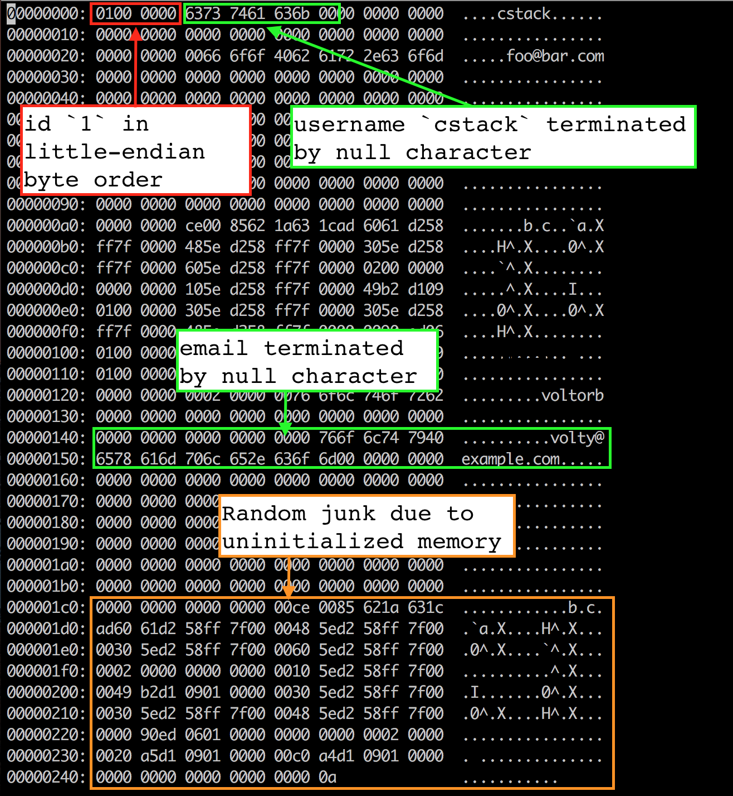
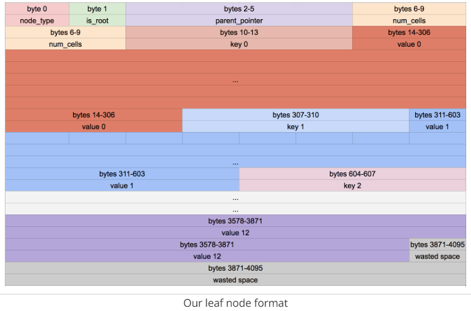

ps：为什么是Cpp后缀名？因为一些常量的定义gcc报错，图方便改为g++ mydb.cpp -o db 后通过编译，实际上没有用上C++的语法，将常量改为宏定义当纯C也能通过
环境使用的是VMware虚拟机下的centos系统

# 建立一个简单的数据库

[原文来源](https://cstack.github.io/db_tutorial/)

数据库是如何工作的?

* 数据是以什么格式存储的？（在内存和在磁盘）
* 它什么时候从每次移动到磁盘？
* 为什么每个表只能有一个主键？
* 回滚事务是如何工作的？
* 索引是如何格式化的？
* 何时以及如何进行全表扫描？
* 预编译语句以什么格式保存？

简而言之，一个数据库如何工作？

为了便于理解，本文用C语言从头构建了一个sqlite的克隆。

## 目录

[toc]
*“What I cannot create, I do not understand.” – Richard Feynman*
*“知行合一” - 王守仁*


## 1 介绍并配置REPL

作为一个web开发工程师（原文作者，为了方便，翻译时都使用第一人称），在工作中我每天都要用到关系性数据库，但它们对我来说是一个黑盒。我有一些问题：

* 数据是以什么格式存储的？（在内存和在磁盘）
* 它什么时候从每次移动到磁盘？
* 为什么每个表只能有一个主键？
* 回滚事务是如何工作的？
* 索引是如何格式化的？
* 何时以及如何进行全表扫描？
* 预编译语句以什么格式保存？

简而言之，一个数据库如何工作？

为了弄清楚这些，我从头开始编写一个数据库。它以sqlite为模型，因为它设计得比MySQL或PostGRESQL更小，功能更少，所以我有更多的希望去理解它。它的整个数据库存储在一个文件中！

### Sqlite

在它们的网站上有很多关于sqlite内部结构的文档，另外我有一份sqlite数据库系统:设计和实现。

在Sqlite官网上有很多关于[sqlite内部结构的文档](https://www.sqlite.org/arch.html)
结构目录如下
>分词器 Tokenizer
>解析器 Parser
>代码生成器 Code Generator
>虚拟机 Virtual Machine
>B树 B-Tree
>页管理器 Pager
>操作系统接口 OS Interface

一个查询通过一个组件链来检索和修改数据。前端由以下组成：

* 分词器
* 解析器
* 代码生成器

前端的输入是一个SQL查询。输出是sqlite虚拟机的字节码(本质上是一个可以操作数据库的编译程序)。

后端由以下组成：

* 虚拟机
* B树
* 页管理器
* 操作系统接口

**虚拟机**接受前端生成的字节码作为指令。然后，它可以对一个或多个表或索引执行操作，每个表或索引都存储在被称为b树的数据结构中。虚拟机本质上是字节码指令类型上的一个大型switch表达式。

**B树**由许多节点组成。每个节点的大小都是一页。B树可以通过向页管理器发出命令从磁盘检索页或将页存回磁盘。

**页管理器**接收读取或写入数据页的命令。它负责在数据库文件中读取/写入适当的偏移量。它还在内存中保存最近访问的页面的缓存，并确定何时需要将这些页面写回磁盘。

**操作系统接口**是根据sqlite为哪个操作系统做编译的层，本文教程不考虑支持多系统

千里之行，始于足下，让我们从一些更直接的东西开始:REPL（交互式解释器环境，Read-Evaluate-Print Loop）。

### 做一个简单的REPL

当你从[命令行启动Sqlite](https://www.sqlite.org/cli.html)时，Sqlite会启动一个read-execute-print循环:
(Linux一般自带，没的话就sudo apt install sqlite3)

```command line
$ sqlite3
SQLite version 3.31.1 2020-01-27 19:55:54
Enter ".help" for usage hints.
Connected to a transient in-memory database.
Use ".open FILENAME" to reopen on a persistent database.
sqlite> create table users (id int, username varchar(255), email varchar(255));
sqlite> .tables
users
sqlite> .exit
```

为此，我们的main函数将有一个无限循环，用来打印提示符，获取一行输入，然后处理这一行输入

```C
int main(int argc, char* argv[]) {
    InputBuffer* input_buffer = new_input_buffer();
    while (true) {
        print_prompt();
        read_input(input_buffer);

        if (strcmp(input_buffer->buffer, ".exit") == 0) {
            close_input_buffer(input_buffer);
            exit(EXIT_SUCCESS);
        } else {
            print("Unrecognized command '%s'. \n", input_buffer->buffer);
        }
    }
}
```

我们将把InputBuffer定义为一个小包装器，用来包装需要存储的状态，以便与getline()进行交互。(稍后详述)
我们将把InputBuffer定义为一个小的封装类（small wrapper），用来封装需要存储的状态，以便于getline()进行交互（稍后叙述）

```C
typedef struct {
    char* buffer;
    size_t buffer_length;
    ssize_t input_length;
} InputBuffer;

InputBuffer* new_input_buffer() {
    InputBuffer* input_buffer = (InputBuffer*)malloc(sizeof(InputBuffer));
    input_buffer->buffer = NULL;
    input_buffer->buffer_length = 0;
    input_buffer->input_length = 0;

    return input_buffer;
}

```

接下来，我们在读取每一行输入之前，使用print_prompt()将提示符打印给用户。

```C
void print_prompt() {
    printf("db > ");
}
```

要读取一行输入，使用[getline()](https://man7.org/linux/man-pages/man3/getline.3.html)，位于stdio.h，:

```C
ssize_t getline(char** lineptr, size_t *n, FILE* stream);
```

lineptr:一个指向变量的指针，用于指向包含读取行的缓冲区。如果它被设为NULL，那么getline会为存储该行其分配一个缓冲区，它应该由用户是否，即使命令失败。
n:指向一个用于存储分配缓存大小的变量的指针。
stream:要从中读取的输入流。我们将从标准输入中读取。
返回值:读取的字节数，它可能小于缓冲区的大小。

我们告诉getline将读取的行存储在input_buffer->buffer中，并将分配的缓冲区的尺寸存储在input_buffer->buffer_length中。我们将返回值存储在input_buffer->input_length中。

buffer一开始为空，因此getline分配足够的内存来保存输入行，并使buffer指向它。

```C
void read_input(InputBuffer* input_buffer) {
    ssize_t bytes_read = getline(&(input_buffer->buffer), &(input_buffer->buffer_length), stdin);

    if (bytes_read <= 0) {
        printf("Error reading input\n");
        exit(EXIT_FAILURE);
    }

    // 忽略末尾的换行符
    input_buffer->input_length = bytes_read - 1;
    input_buffer->buffer[bytes_read - 1] = 0;
}
```

现在可以定义一个函数来释放分配给InputBuffer* 的实例及其结构内的buffer元素的内存（getline在read_input中为input_buffer->buffer分配的内存）

```C
void close_input_buffer(InputBuffer* input_buffer) {
    free(input_buffer->buffer);
    free(input_buffer);
}
```

最后，我们解析并执行命令。目前只有一个可识别的命令:.exit，它终止程序。否则将打印错误消息并继续循环。

```C
if (strcmp(input_buffer->buffer, ".exit") == 0) {
    close_input_buffer(input_buffer);
    exit(EXIT_SUCCESS);
} else {
    printf("Unrecognized command '%s' .\n", input_buffer->buffer);
}
```

让我们试试吧！

```shell
$ gcc mydb.c -o db
$ ./db
db > .tables
Unrecognized command '.tables' .
db > .exit
$
```

好的，我们获得了一个有效的REPL。在下一部分中，我们将开始开发我们的命令语言。与此同时，下面是这部分的整个程序:

```C
#include <stdio.h>
#include <stdbool.h>
#include <stdlib.h>
#include <string.h>

// 读取命令的缓存结构
typedef struct {
    char* buffer;   // 记录输入的一行命令
    size_t buffer_length;   // 记录缓冲区的大小
    ssize_t input_length;   // 存放输入的字符串个数
    // (ssize_t 是在linux环境下的一个类型unsign size_t， windows中vscode会有错误提示)
} InputBuffer;

// 新建一个缓存结构，初始化并返回
InputBuffer* new_input_buffer() {
    InputBuffer* input_buffer = malloc(sizeof(InputBuffer));
    input_buffer->buffer = NULL;
    input_buffer->buffer_length = 0;
    input_buffer->input_length = 0;

    return input_buffer;
}

// 打印提示
void print_prompt() {
    printf("db > ");
}

// 读取输入
void read_input(InputBuffer* input_buffer) {
    ssize_t bytes_read= getline(&(input_buffer->buffer), &(input_buffer->buffer_length), stdin);
    if (bytes_read <= 0) {
        // 读取字符失败
        printf("Error reading input\n");
        exit(EXIT_FAILURE);
    }

    // 忽略末尾换行符的长度
    input_buffer->input_length = bytes_read - 1;
    // 将原本换行符的位置变为0
    input_buffer->buffer[bytes_read - 1] = 0;
}

// 关闭读取命令的缓存，释放资源
void close_input_buffer(InputBuffer* input_buffer) {
    // 需要先是否缓存，在释放整个结构体
    free(input_buffer->buffer);
    free(input_buffer);
}

int main(int argc, char* argv[]) {
    InputBuffer* input_buffer = new_input_buffer();
    // 无限循环，知道系统错误或退出指令
    while (true) {
        print_prompt(); // 打印提示符
        read_input(input_buffer);   // 读取一行输入

        if (strcmp(input_buffer->buffer, ".exit") == 0) {
            // 输入了退出指令，释放资源并退出系统
            close_input_buffer(input_buffer);
            exit(EXIT_SUCCESS);
        } else {
            // 输入了其他的未定义的命令
            printf("Unrecognized command '%s' .\n", input_buffer->buffer);
        }
    }
}

```

## 2 世界上最简单的SQL编译器和虚拟机

我们正在做一个sqlite的克隆，sqlite的“前端”是一个SQL编译器，它解析字符串并输出称为字节码的内部表示。
这个字节码被传递给虚拟机，虚拟机负责执行它。


像这样把事情分成两步有几个好处:

* 减少每个部分的复杂性(例如，虚拟机不担心语法错误)
* 允许一次编译通用查询并缓存字节码以提高性能

考虑到这一点，让我们重构我们的主函数，并在过程中支持两个新的关键字:

```C
int main(int argc, char* argv[]) {
    InputBuffer* input_buffer = new_input_buffer();
    while (true) {
        print_prompt();
        read_input(input_buffer);

        // if (strcmp(input_buffer->buffer, ".exit") == 0) {
        //     close_input_buffer(input_buffer);
        //     exit(EXIT_SUCCESS);
        // } else {
        //     printf("Unrecognized command '%s' .\n", input_buffer->buffer);
        // }
        if (input_buffer->buffer[0] == '.') {
            switch (do_meta_command(input_buffer)) {
                case META_COMMAND_SUCCESS:
                    break;
                case META_COMMAND_UNRECOGNIZED_COMMAND:
                    printf("Unrecongnized command '%s'\n", input_buffer->buffer);
                    break;
            }
        }

        Statement statement;
        switch (prepare_statement(input_buffer, &statement)) {
            case PREPARE_SUCCESS:
                break;
            case PREPARE_UNRECOGNIZED_STATEMENT:
                printf("Unrecognized keyword at start of '%s'.\n", input_buffer->buffer);
                break;
        }
        execute_statement(&statement);
        printf("Executed.\n");
    }
}
```

像.exit这样的非sql语句被称为“元命令”。它们都以一个点开始，所以我们检查它们并在一个单独的函数中处理它们。
接下来，我们添加一个步骤，将输入行转换为语句的内部表示形式。这是我们的sqlite前端的粗糙版本。
最后，将预处理（预编译）好的语句传递给execute_statement。这个函数最终将成为我们的虚拟机。

注意，我们的两个新函数返回指示成功或失败的枚举:

```C
typedef enum {
    META_COMMAND_SUCCESS,
    META_COMMAND_UNRECOGNIZED_COMMAND
} MetaCommandResult;

typedef enum {
    PREPARE_SUCCESS,
    PREPARE_UNRECOGNIZED_STATEMENT
} PrepareResult;
```

“未被声明”?这似乎是个异常。我不喜欢使用异常(C甚至不支持异常)，所以我在实际情况下使用枚举结果代码。如果我的switch语句没有处理枚举的成员，C编译器将会报错，所以我们可以更有信心地处理函数的每个结果。预计未来将添加更多的结果代码。
do_meta_command只是现有功能的封装，为更多命令留下了空间:

```C
MetaCommandResult do_meta_command(InputBuffer* input_buffer) {
    if (strcmp(input_buffer->buffer, ".exit") == 0) {
        exit(EXIT_SUCCESS);
    } else {
        return META_COMMAND_UNRECOGNIZED_COMMAND;
    }
}
```

我们的“预处理语句（或预编译语句，prepared statement）”现在只包含一个带有两个可能值的枚举。之后它将包含更多的数据，因为我们需要在语句中使用参数:

```C
typedef enum {
    STATEMENT_INSERT,
    STATEMENT_SELECT
} StatementType;

typedef struct {
    StatementType type;
} Statement;
```

prepare_statement(我们的“SQL编译器”)现在不理解SQL。事实上，它只懂两个词:

```C
PrepareResult prepare_statement(InputBuffer* input_buffer, 
                                Statement* statement) {
    if (strncmp(input_buffer->buffer, "insert", 6) == 0) {
        statement->type = STATEMENT_INSERT;
        return PREPARE_SUCCESS;
    }
    if (strcmp(input_buffer->buffer, "select") == 0) {
        statement->type = STATEMENT_SELECT;
        return PREPARE_SUCCESS;
    }
    return PREPARE_UNRECOGNIZED_STATEMENT;
}
```

注意，我们对“insert”使用strncmp，因为“insert”关键字后面会跟着数据。(例如，insert 1 cstack foo@bar.com)
最后，execute_statement包含一些存根（stubs，用于执行后的一些日志记录）:

```C
void execute_statement(Statement* statement) {
    switch (statement->type) {
        case STATEMENT_INSERT:
            printf("This is where we would do an insert.\n");
            break;
        case STATEMENT_SELECT:
            printf("This is where we would do an select.\n");
            break;
    }
}
```

注意，它不会返回任何错误代码，因为目前还没有可能出错的地方。
通过这些重构，我们现在可以识别出两个新的关键字!

```shell
$ gcc mydb2.c -o db
$ ./db
db > insert foo bar
This is where we would do an insert.
Executed.
db > delete foo
Unrecognized keyword at start of 'delete foo'.
db > select
This is where we would do an select.
Executed.
db > .tables
Unrecongnized command '.tables'
db > .exit
$ 
```

我们数据库的框架正在成形，如果它能存储数据不是很好吗?在下一部分中，我们将实现插入和选择，创建世界上最差的数据存储。与此同时，以下是与这部分的全部差异:

```C
// 省略部分和之前完全相同
// 省略头文件
// 省略InputBuffer

// 元命令执行结果的枚举
typedef enum {
    META_COMMAND_SUCCESS,   // 执行成功
    META_COMMAND_UNRECOGNIZED_COMMAND   // 未定义命令
} MetaCommandResult;

// 预处理（预编译）语句执行结果的枚举
typedef enum {
    PREPARE_SUCCESS,    // 预处理成功
    PREPARE_UNRECOGNIZED_STATEMENT  // 未定义语句
} PrepareResult;

// SQL预处理语句的类型的枚举
typedef enum {
    STATEMENT_INSERT,   // insert开头的插入
    STATEMENT_SELECT    // select开头的查询
} StatementType;

// 表示一条SQL语句信息的结构
typedef struct {
    StatementType type;
} Statement;

// 省略new_input_buffer、print_prompt、read_input、close_input_buffer函数

// 执行元命令
MetaCommandResult do_meta_command(InputBuffer* input_buffer) {
    if (strcmp(input_buffer->buffer, ".exit") == 0) {
        // 退出命令，直接退出
        exit(EXIT_SUCCESS);
    } else {
        // 返回未标识元命令
        return META_COMMAND_UNRECOGNIZED_COMMAND;
    }
}

// 解析命令，将解析结果存到statement中，返回解析结果
PrepareResult prepare_statement(InputBuffer* input_buffer, 
                                Statement* statement) {
    if (strncmp(input_buffer->buffer, "insert", 6) == 0) {
        // 以insert开头
        statement->type = STATEMENT_INSERT;
        return PREPARE_SUCCESS;
    }
    if (strcmp(input_buffer->buffer, "select") == 0) {
        // 以select开头
        statement->type = STATEMENT_SELECT;
        return PREPARE_SUCCESS;
    }
    return PREPARE_UNRECOGNIZED_STATEMENT;
}

// 执行sql语句
void execute_statement(Statement* statement) {
    switch (statement->type) {
        case STATEMENT_INSERT:
            printf("This is where we would do an insert.\n");
            break;
        case STATEMENT_SELECT:
            printf("This is where we would do an select.\n");
            break;
    }
}

int main(int argc, char* argv[]) {
    InputBuffer* input_buffer = new_input_buffer();
    // 无限循环，知道系统错误或退出指令
    while (true) {
        print_prompt(); // 打印提示符
        read_input(input_buffer);   // 读取一行输入

        // 修改了此处代码
        // if (strcmp(input_buffer->buffer, ".exit") == 0) {
        //     // 输入了退出指令，释放资源并退出系统
        //     close_input_buffer(input_buffer);
        //     exit(EXIT_SUCCESS);
        // } else {
        //     // 输入了其他的未定义的命令
        //     printf("Unrecognized command '%s' .\n", 
        //             input_buffer->buffer);
        // }
        // 以点开头的是元命令
        if (input_buffer->buffer[0] == '.') {
            switch (do_meta_command(input_buffer)) {
                case META_COMMAND_SUCCESS:
                    continue;   // 进入while下一个主循环
                case META_COMMAND_UNRECOGNIZED_COMMAND:
                    printf("Unrecongnized command '%s'\n", 
                            input_buffer->buffer);
                    continue;
            }
        }

        // 解析SQL语句
        Statement statement;
        switch (prepare_statement(input_buffer, &statement)) {
            case PREPARE_SUCCESS:
                break;
            case PREPARE_UNRECOGNIZED_STATEMENT:
                printf("Unrecognized keyword at start of '%s'.\n", 
                        input_buffer->buffer);
                continue;
        }
        // 执行sql语句
        execute_statement(&statement);
        printf("Executed.\n");
    }
}

```

## 3 一个在内存中的、只能添加记录的、单表的数据库

我们将通过在数据库上设置许多限制，来从小的方面开始设计。就目前而言，它将:

* 支持两种操作:插入一行和打印所有行
* 只驻留在内存中(没有持久化到磁盘)
* 支持单个的，硬编码的表

我们的硬编码表将存储用户，看起来像这样:

|   **column**  | **type**  |
|   :---:       |   :---:   |
|   id          |   integer |
|   username    |varchar(32)|
|   email       |varchar(255)|

这是一个简单的模式，但它使我们能够支持多种数据类型和多种大小的文本数据类型。
插入语句现在看起来像这样:

```shell
insert 1 cstack foo@bar.com
```

这意味着我们需要更新prepare_statement函数来解析命令行参数

```C
    if (strncmp(input_buffer->buffer, "insert", 6) == 0) {
        statement->type = STATEMENT_INSERT;
        int args_assigned = sscanf(input_buffer, "insert %d %s %s", 
                                    &(statement->row_to_insert.id),
                                    statement->row_to_insert.username,
                                    statement->row_to_insert.email);
        if (args_assigned < 3) {
            return PREPARE_SYNTAX_ERROR;
        }
        return PREPARE_SUCCESS;
    }
    if (strcmp(input_buffer->buffer, "select") == 0) {
```

我们将这些解析后的参数存储到语句对象内的一个新的“行”数据结构中:

```C
#define COLUMN_USERNAME_SIZE 32
#define COLUMN_EMAIL_SIZE 255

typedef struct {
    uint32_t id;
    char username[COLUMN_USERNAME_SIZE];
    char email[COLUMN_EMAIL_SIZE];
} Row;

typedef struct {
    StatementType type;
    Row row_to_insert;  // 只有插入语句
} Statement;
```

现在我们需要将该数据复制到表示表的某个数据结构中。SQLite使用B树进行快速查找、插入和删除。我们先从简单点的开始。像B树一样，它将一行分组为页，但不是将这些页作为树排列，而是将它们作为数组排列。

这是我的计划:

* 将行存储在称为页的内存块中
* 每个页面存储尽可能多的行
* 行被序列化为每个页的紧凑表示
* 页只在需要时分配
* 维护固定大小的指向页的指针数组

首先，我们将定义一行的紧凑表示:

```C
// 常量0是空指针，将空指针强转为Struct类型指针，然后这个Struct类型指针就可以访问成员
#define size_of_attribute(Struct, Attribute) sizeof(((Struct*)0)->Attribute)

const uint32_t ID_SIZE = size_of_attribute(Row, id);
const uint32_t USERNAME_SIZE = size_of_attribute(Row, username);
const uint32_t EMAIL_SIZE = size_of_attribute(Row, email);
const uint32_t ID_OFFSET = 0;
const uint32_t USERNAME_OFFSET = ID_OFFSET + ID_SIZE;
const uint32_t EMAIL_OFFSET = USERNAME_OFFSET + USERNAME_SIZE;
const uint32_t ROW_SIZE = ID_SIZE + USERNAME_SIZE + EMAIL_SIZE
```

这意味着序列化一行的布局将是这样的:

|**column**|**size(bytes)**|offset|
|:---:|:---:|:---:|
|id|4|0|
|username|32|4|
|email|255|36|
|total|291| |

我们还需要代码来进行转换为紧凑表示。

```C
void serialize_row(Row* source, void* destination) {
    memcpy(destination + ID_OFFSET, &(source->id), ID_SIZE);
    memcpy(destination + USERNAME_OFFSET, &(source->username), USERNAME_SIZE);
    memcpy(destination + EMAIL_OFFSET, &(source->email), EMAIL_SIZE);
}

void deserialize_row(void* source, Row* destination) {
    memcpy(&(destination->id), source + ID_OFFSET, ID_SIZE);
    memcpy(&(destination->username), source + USERNAME_OFFSET, USERNAME_SIZE);
    memcpy(&(destination->email), source + EMAIL_OFFSET, EMAIL_SIZE);
}
```

接下来，一个表结构，它指向行的页并跟踪有一共有多少行:

```C
const uint32_t PAGE_SIZE = 4096;
#define TABLE_MAX_PAGES 100
const uint32_t ROWS_PER_PAGE = PAGE_SIZE / ROW_SIZE;
const uint32_t TABLE_MAX_ROWS = ROWS_PER_PAGE * TABLE_MAX_PAGES;

typedef struct {
    uint32_t num_rows;
    void* pages[TABLE_MAX_PAGES];
} Table;
```

我将我们的页大小设为4千字节，因为它与大多数计算机架构的虚拟内存系统中使用的页大小相同。这意味着数据库中的一个页对应于操作系统使用的一个页。操作系统将把页作为整个单元移进移出内存，而不是将它们分开。
我武断地设定了100页的分配限制。当我们切换到树形结构时，数据库的最大尺寸将只受文件的最大尺寸的限制。(尽管我们仍然会限制一次在内存中保存的页面数量)
行不应该跨越页的边界。由于页可能不会在内存中相邻，因此这种假设使读/写行更容易。
说到这里，下面是我们如何理清在内存中对特定行进行读写的方法:

```C
void* row_slot(Table* table, uint32_t row_num) {
    uint32_t page_num = row_num / ROWS_PER_PAGE;
    void* page = table->pages[page_num];
    if (page == NULL) {
        // 只有在我们试图访问页时，才分配内存
        page = table->pages[page_num] = malloc(PAGE_SIZE);
    }
    uint32_t row_offset = row_num % ROWS_PER_PAGE;
    uint32_t byte_offset = row_offset * ROW_SIZE;
    return page + byte_offset;
}
```

现在我们可以让execute_statement从我们的表结构中读/写:

```C
// void execute_statement(Statement* statement) {
ExecuteResult execute_insert(Statement* statement, Table* table) {
    if (table->num_rows >= TABLE_MAX_ROWS) {
        return EXECUTE_TABLE_FULL;
    }
    Row* row_to_insert = &(statement->row_to_insert);

    serialize_row(row_to_insert, row_slot(table, table->num_rows));
    table->num_rows += 1;

    return EXECUTE_SUCCESS;
}

ExecuteResult execute_select(Statement* statement, Table* table) {
    Row row;
    for (uint32_t i = 0; i < table->num_rows; ++i) {
        deserialize_row(row_slot(table, i), &row);
        print_row(&row);
    }
    return EXECUTE_SUCCESS;
}

ExecuteResult execute_statement(Statement* statement, Table* table) {
    switch (statement->type) {
        case STATEMENT_INSERT:
            // printf("This is where we would do an insert.\n");
            // break;
            return execute_insert(statement, table);
        case STATEMENT_SELECT:
            // printf("This is where we would do an select.\n");
            // break;
            return execute_insert(statement, table);
    }
}
```

最后，我们需要初始化表，创建各自的内存释放函数，并处理更多的错误情况
(注意！ free_table中还要限制i < TABLE_MAX_PAGES，否则在页面满的时候，每个page都不为null，会发生访问越界，原文此处没加，在原文第四节测试中会有bug且没有说明)

```C
Table* new_table() {
    Table* table = (Table*)malloc(sizeof(Table));
    table->num_rows = 0;
    for (uint32_t i = 0; i < TABLE_MAX_PAGES; ++i) {
        table->pages[i] = NULL;
    }
    return table;
}

void free_table(Table* table) {
    for (int i = 0; table->pages[i] && i < TABLE_MAX_PAGES; ++i) {
        free(table->pages[i]);
    }
    free(table);
}
```

```C
int main(int argc, char* argv[]) {
    Table* table = new_table();
    InputBuffer* input_buffer = new_input_buffer();
    while (true) {
        print_prompt(); // 打印提示符
        
        // 省略 if (input_buffer->buffer[0] == '.')...

        // 解析SQL语句
        Statement statement;
        switch (prepare_statement(input_buffer, &statement)) {
            case PREPARE_SUCCESS:
                break;
            case PREPARE_SYNTAX_ERROR:
                printf("Syntax error. Could not parse statement. \n");
                continue;
            case PREPARE_UNRECOGNIZED_STATEMENT:
                printf("Unrecognized keyword at start of '%s'.\n", 
                        input_buffer->buffer);
                continue;
        }
        // execute_statement(&statement);
        // printf("Executed.\n");
        switch (execute_statement(&statement, table)) {
            case EXECUTE_SUCCESS:
                printf("Executed.\n");
                break;
            case EXECUTE_TABLE_FULL:
                printf("Error: Table full.\n");
                break;
        }
    }
}
```

通过这些更改，我们可以将数据保存到我们的数据库中了!

```shell
$ gcc mydb3.c -o db
$ ./db
db > insert 1 cstack foo@bar.com
Executed.
db > insert 2 bob bob@example.com
Executed.
db > select
(1, cstack, foo@bar.com)
(2, bob, bob@example.com)
Executed.
db > insert foo bar 1
Syntax error. Could not parse statement. 
db > .exit
$
```

现在是编写一些测试的好时机，原因如下:

* 我们计划大幅改变存储表的数据结构，测试将会捕获回归（tests would catch regressions)（没理解，可能是回归测试的意思？）。
* 有几个边界条件我们还没有手动测试（例如，填满表格）

我们将在下一部分讨论这些问题。和现在的部分相比，那是完全不同的部分:

```C
// 省略stdio.h stdlib.h string.h
#include <stdint.h>

// 省略InputBuffer;

// SQL语句执行结果的枚举
typedef enum {
    EXECUTE_SUCCESS,
    EXECUTE_TABLE_FULL
} ExecuteResult;

// 元命令执行结果的枚举
typedef enum {
    META_COMMAND_SUCCESS,   // 执行成功
    META_COMMAND_UNRECOGNIZED_COMMAND   // 未定义命令
} MetaCommandResult;

// 预处理（预编译）语句执行结果的枚举
typedef enum {
    PREPARE_SUCCESS,    // 预处理成功
    PREPARE_SYNTAX_ERROR,   // 语句存在语法错误
    PREPARE_UNRECOGNIZED_STATEMENT  // 未定义语句
} PrepareResult;

// SQL预处理语句的类型的枚举
typedef enum {
    STATEMENT_INSERT,   // insert开头的插入
    STATEMENT_SELECT    // select开头的查询
} StatementType;

#define COLUMN_USERNAME_SIZE 32 // 用户名长度
#define COLUMN_EMAIL_SIZE 255   // 邮箱长度

// 数据库中，固定的一行的结构体
typedef struct {
    uint32_t id;    // 用户id
    char username[COLUMN_USERNAME_SIZE];    // 存放用户名的字符数组
    char email[COLUMN_EMAIL_SIZE];  // 存放邮箱的字符数组
} Row;

// 表示一条SQL语句信息的结构
typedef struct {
    StatementType type; // 语句类型。是insert还是select等
    Row row_to_insert;  // 只用于插入语句
} Statement;

// 常量0是空指针，将空指针强转为Struct类型指针，然后这个Struct类型指针就可以访问成员
#define size_of_attribute(Struct, Attribute) sizeof(((Struct*)0)->Attribute)

const uint32_t ID_SIZE = size_of_attribute(Row, id);    // id占用内存大小
const uint32_t USERNAME_SIZE = size_of_attribute(Row, username);  // 用户名占用内存大小  
const uint32_t EMAIL_SIZE = size_of_attribute(Row, email);  // 邮箱占用内存大小
const uint32_t ID_OFFSET = 0;   // 初始位置内存偏移量，也就是在行指针指向的开头
const uint32_t USERNAME_OFFSET = ID_OFFSET + ID_SIZE;   // 用户名位置偏移量
const uint32_t EMAIL_OFFSET = USERNAME_OFFSET + USERNAME_SIZE;  // 邮箱位置偏移量
const uint32_t ROW_SIZE = ID_SIZE + USERNAME_SIZE + EMAIL_SIZE; // 一行最小占用内存空间

#define TABLE_MAX_PAGES 100         // 定义一个表最多100页
const uint32_t PAGE_SIZE = 4096;    // 定义一页大小为4096字节
const uint32_t ROWS_PER_PAGE = PAGE_SIZE / ROW_SIZE;    // 每页能放的行数
const uint32_t TABLE_MAX_ROWS = ROWS_PER_PAGE * TABLE_MAX_PAGES;    //一个表最多有多少行

// 一个表结构的结构体
typedef struct {
    uint32_t num_rows;  // 记录当前的行数
    void* pages[TABLE_MAX_PAGES];   // 表中的每一页
} Table;

// 打印出一行
void print_row(Row* row) {
    printf("(%d, %s, %s)\n", row->id, row->username, row->email);
}

// 序列化一行，将结构体进行压缩，使一行在内存中是紧凑的结构
// source是行结构体的指针，destination是要存放的紧凑内存的位置开头
void serialize_row(Row* source, void* destination) {
    memcpy(destination + ID_OFFSET, &(source->id), ID_SIZE);
    memcpy(destination + USERNAME_OFFSET, &(source->username), USERNAME_SIZE);
    memcpy(destination + EMAIL_OFFSET, &(source->email), EMAIL_SIZE);
}

// 将内存中紧凑的一行内容反序列化为结构体
// source是存放一行的内存紧凑结构的开始位置，destination是存放一行的结构体
void deserialize_row(void* source, Row* destination) {
    memcpy(&(destination->id), source + ID_OFFSET, ID_SIZE);
    memcpy(&(destination->username), source + USERNAME_OFFSET, USERNAME_SIZE);
    memcpy(&(destination->email), source + EMAIL_OFFSET, EMAIL_SIZE);
}

// 找到要插入到表中的位置
void* row_slot(Table* table, uint32_t row_num) {
    uint32_t page_num = row_num / ROWS_PER_PAGE;    // 第row_num行在第page_num页
    void* page = table->pages[page_num];    //指向第page_num页的指针
    if (page == NULL) {
        // 如果该页还未分配，说明当前行是新一页的第一行
        // 只有在我们试图访问页时，才分配内存
        page = table->pages[page_num] = malloc(PAGE_SIZE);
    }
    uint32_t row_offset = row_num % ROWS_PER_PAGE;  // 位于当前页的第几行
    uint32_t byte_offset = row_offset * ROW_SIZE;   // 当前行在本页的内存偏移量
    return page + byte_offset;  // 返回要插入行的位置的指针
}

// 新建并初始化一个表，返回这个表的指针
Table* new_table() {
    Table* table = (Table*)malloc(sizeof(Table));
    table->num_rows = 0;    // 初始有0行
    // 将指向每一页的指针置为空
    for (uint32_t i = 0; i < TABLE_MAX_PAGES; ++i) {
        table->pages[i] = NULL;
    }
    return table;
}

// 释放表资源
void free_table(Table* table) {
    // 先释放每一页的资源,从头开始释放直到空页或到达最后一页
    for (int i = 0; table->pages[i] && i < TABLE_MAX_PAGES; ++i) {
        free(table->pages[i]);
    }
    // 再释放整个表
    free(table);
}

// 省略new_input_buffer()、print_prompt()、read_input、close_input_buffer

// 执行元命令
MetaCommandResult do_meta_command(InputBuffer* input_buffer, Table* table) {
    if (strcmp(input_buffer->buffer, ".exit") == 0) {
        // 退出命令，关闭输入缓存区，释放整张表
        close_input_buffer(input_buffer);
        free_table(table);
        exit(EXIT_SUCCESS);
    } else {
        // 返回未标识元命令
        return META_COMMAND_UNRECOGNIZED_COMMAND;
    }
}

// 解析命令，将解析结果存到statement中，返回解析结果
PrepareResult prepare_statement(InputBuffer* input_buffer, 
                                Statement* statement) {
    if (strncmp(input_buffer->buffer, "insert", 6) == 0) {
        // 以insert开头
        statement->type = STATEMENT_INSERT;
        // 将insert的内容存放到一个行结构体中
        int args_assigned = sscanf(input_buffer->buffer, "insert %d %s %s", 
                                    &(statement->row_to_insert.id),
                                    statement->row_to_insert.username,
                                    statement->row_to_insert.email);
        if (args_assigned < 3) {
            // 输入的内容不足，目前需要id, name,eamil
            return PREPARE_SYNTAX_ERROR;
        }
        return PREPARE_SUCCESS;
    }
    if (strcmp(input_buffer->buffer, "select") == 0) {
        // 以select开头
        statement->type = STATEMENT_SELECT;
        return PREPARE_SUCCESS;
    }
    return PREPARE_UNRECOGNIZED_STATEMENT;
}

// 执行插入语句，返回是否执行结果的枚举
// void execute_statement(Statement* statement) {
ExecuteResult execute_insert(Statement* statement, Table* table) {
    // 表已经满了
    if (table->num_rows >= TABLE_MAX_ROWS) {
        return EXECUTE_TABLE_FULL;
    }
    // 一行的结构体存放在statement中，先取出
    Row* row_to_insert = &(statement->row_to_insert);

    // 序列化行结构体，并插入到表中
    serialize_row(row_to_insert, row_slot(table, table->num_rows));
    table->num_rows += 1;   // 表中的行数+1

    return EXECUTE_SUCCESS;
}

// 执行查询语句，查询一个表中的全部内容，并打印到控制台
ExecuteResult execute_select(Statement* statement, Table* table) {
    Row row;
    for (uint32_t i = 0; i < table->num_rows; ++i) {
        deserialize_row(row_slot(table, i), &row);
        print_row(&row);
    }
    return EXECUTE_SUCCESS;
}

// 统一判断要执行语句，并将其执行
ExecuteResult execute_statement(Statement* statement, Table* table) {
    switch (statement->type) {
        case STATEMENT_INSERT:
            return execute_insert(statement, table);
        case STATEMENT_SELECT:
            return execute_select(statement, table);
    }
}

int main(int argc, char* argv[]) {
    Table* table = new_table();
    InputBuffer* input_buffer = new_input_buffer();
    // 无限循环，知道系统错误或退出指令
    while (true) {
        print_prompt(); // 打印提示符
        read_input(input_buffer);   // 读取一行输入
        if (input_buffer->buffer[0] == '.') {
            switch (do_meta_command(input_buffer, table)) {
                case META_COMMAND_SUCCESS:
                    continue;   // 进入while下一个主循环
                case META_COMMAND_UNRECOGNIZED_COMMAND:
                    printf("Unrecongnized command '%s'\n", 
                            input_buffer->buffer);
                    continue;
            }
        }

        // 解析SQL语句，解析结果放到statement结构体中。
        Statement statement;
        switch (prepare_statement(input_buffer, &statement)) {
            case PREPARE_SUCCESS:
                break;
            case PREPARE_SYNTAX_ERROR:
                printf("Syntax error. Could not parse statement. \n");
                continue;
            case PREPARE_UNRECOGNIZED_STATEMENT:
                printf("Unrecognized keyword at start of '%s'.\n", 
                        input_buffer->buffer);
                continue;
        }
        // 执行sql语句
        // execute_statement(&statement);
        // printf("Executed.\n");
        switch (execute_statement(&statement, table)) {
            case EXECUTE_SUCCESS:
                printf("Executed.\n");
                break;
            case EXECUTE_TABLE_FULL:
                printf("Error: Table full.\n");
                break;
        }
    }
}
```

## 4 第一个测试（及其bug）

我们能够向数据库中插入行并打印出所有行。让我们花点时间来测试一下我们目前得到的信息
我将使用[rspec](http://rspec.info/)来编写测试，因为我熟悉它（作为翻译者我完全不懂），而且它的语法相当可读。
安装rspec

```shell
$ sudo apt install ruby-bundler
$ vim Gemfile
source "https://rubygems.org"
  
gem 'rspec', '~>3.0'
:wq

$ bundle install --binstubs
```

我将定义一个简短的帮助程序，向数据库程序发送一系列命令，然后对输出进行断言:

```ruby
$ vim testdb3.rb
describe 'database' do
  def run_script(commands)
    raw_output = nil
    IO.popen("./db", "r+") do |pipe|
      commands.each do |command|
        pipe.puts command
      end

      pipe.close_write

      # Read entire output
      raw_output = pipe.gets(nil)
    end
    raw_output.split("\n")
  end

  it 'inserts and retrieves a row' do
    result = run_script([
      "insert 1 user1 person1@example.com",
      "select",
      ".exit",
    ])
    expect(result).to match_array([
      "db > Executed.",
      "db > (1, user1, person1@example.com)",
      "Executed.",
      "db > ",
    ])
  end
end

:wq
```

这个简单的测试能确保我们得到我们输入东西的结果。且它确实通过了:

```shell
$ rspec spec testdb3.rb

Finished in 0.00233 seconds (files took 0.04599 seconds to load)
1 example, 0 failures
```

现在测试向数据库中插入大量行是可行的（上面中的testdb3.rb后半部分再添加如下内容）:

```ruby
it 'prints error message when table is full' do
  script = (1..1401).map do |i|
    "insert #{i} user#{i} person#{i}@example.com"
  end
  script << ".exit"
  result = run_script(script)
  expect(result[-2]).to eq('db > Error: Table full.')
end
```

再次运行测试...

```shell
$ rspec spec testdb3.rb 
..

Finished in 0.02898 seconds (files took 0.0582 seconds to load)
2 examples, 0 failures
```

太好了，成功了!我们的数据库现在可以容纳1400行，因为我们将最大页面数设置为100，一个页面可以容纳14行(目前一行4+32+255字节，一页4096字节，4096/291=14.07）。
通读到目前为止的代码，我意识到我们可能无法正确处理文本字段的存储。用这个示例很容易进行测试（.rb文件的前部分通用，之后的测试只在文件内容后添加新的测试代码）

```ruby
  it 'allows inserting strings that are the maximum length' do
    long_username = "a"*32
    long_email = "a"*255
    script = [
      "insert 1 #{long_username} #{long_email}",
      "select",
      ".exit",
    ]
    result = run_script(script)
    expect(result).to match_array([
      "db > Executed.",
      "db > (1, #{long_username}, #{long_email})",
      "Executed.",
      " db > ",
    ])
  end
```

测试失败了！(a的个数不匹配，因为我们代码中分配的字符串数组大小是32和255，还需要包含结尾的符号'\0')

```shell
$ rspec spec testdb4.rb 
..F

Failures:

  1) database allows inserting strings that are the maximum length
     Failure/Error:
       expect(result).to match_array([
         "db > Executed.",
         "db > (1, #{long_username}, #{long_email})",
         "Executed.",
         "db > ",
       ])
     
       expected collection contained:  ["Executed.", "db > ", "db > (1, aaaaaaaaaaaaaaaaaaaaaaaaaaaaaaaa, aaaaaaaaaaaaaaaaaaaaaaaaaaaaaaaaaa...aaaaaaaaaaaaaaaaaaaaaaaaaaaaaaaaaaaaaaaaaaaaaaaaaaaaaaaaaaaaaaaaaaaaaaaaaaaaaaa)", "db > Executed."]
       actual collection contained:    ["Executed.", "db > ", "db > (1, aaaaaaaaaaaaaaaaaaaaaaaaaaaaaaaaaaaaaaaaaaaaaaaaaaaaaaaaaaaaaaaaaaaa...aaaaaaaaaaaaaaaaaaaaaaaaaaaaaaaaaaaaaaaaaaaaaaaaaaaaaaaaaaaaaaaaaaaaaaaaaaaaaaa)", "db > Executed."]
       the missing elements were:      ["db > (1, aaaaaaaaaaaaaaaaaaaaaaaaaaaaaaaa, aaaaaaaaaaaaaaaaaaaaaaaaaaaaaaaaaaaaaaaaaaaaaaaaaaaaaaaa...aaaaaaaaaaaaaaaaaaaaaaaaaaaaaaaaaaaaaaaaaaaaaaaaaaaaaaaaaaaaaaaaaaaaaaaaaaaaaaaaaaaaaaaaaaaaaaaaa)"]
       the extra elements were:        ["db > (1, aaaaaaaaaaaaaaaaaaaaaaaaaaaaaaaaaaaaaaaaaaaaaaaaaaaaaaaaaaaaaaaaaaaaaaaaaaaaaaaaaaaaaaaaaa...aaaaaaaaaaaaaaaaaaaaaaaaaaaaaaaaaaaaaaaaaaaaaaaaaaaaaaaaaaaaaaaaaaaaaaaaaaaaaaaaaaaaaaaaaaaaaaaaa)"]
     # ./testdb4.rb:49:in `block (2 levels) in <top (required)>'

Finished in 0.0164 seconds (files took 0.06689 seconds to load)
3 examples, 1 failure

Failed examples:

rspec ./testdb4.rb:40 # database allows inserting strings that are the maximum length
```

如果我们自己试试，当我们试图打印出行时，会有一些奇怪的字符(输入1, 32个a，255个a，输出时个数变得奇怪，和原文的效果不一样，确实怪了）

```shell
$ ./db
db > insert 1 aaaaaaaaaaaaaaaaaaaaaaaaaaaaaaaa aaaaaaaaaaaaaaaaaaaaaaaaaaaaaaaaaaaaaaaaaaaaaaaaaaaaaaaaaaaaaaaaaaaaaaaaaaaaaaaaaaaaaaaaaaaaaaaaaaaaaaaaaaaaaaaaaaaaaaaaaaaaaaaaaaaaaaaaaaaaaaaaaaaaaaaaaaaaaaaaaaaaaaaaaaaaaaaaaaaaaaaaaaaaaaaaaaaaaaaaaaaaaaaaaaaaaaaaaaaaaaaaaaaaaaaaaaaaaaaaaaaaaaaaaaaaaaa
Executed.
db > select
(1, aaaaaaaaaaaaaaaaaaaaaaaaaaaaaaaaaaaaaaaaaaaaaaaaaaaaaaaaaaaaaaaaaaaaaaaaaaaaaaaaaaaaaaaaaaaaaaaaaaaaaaaaaaaaaaaaaaaaaaaaaaaaaaaaaaaaaaaaaaaaaaaaaaaaaaaaaaaaaaaaaaaaaaaaaaaaaaaaaaaaaaaaaaaaaaaaaaaaaaaaaaaaaaaaaaaaaaaaaaaaaaaaaaaaaaaaaaaaaaaaaaaaaaaaaaaaaaaaaaaaaaaaaaaaaaaaaaaaaaaaaaaaaaa, aaaaaaaaaaaaaaaaaaaaaaaaaaaaaaaaaaaaaaaaaaaaaaaaaaaaaaaaaaaaaaaaaaaaaaaaaaaaaaaaaaaaaaaaaaaaaaaaaaaaaaaaaaaaaaaaaaaaaaaaaaaaaaaaaaaaaaaaaaaaaaaaaaaaaaaaaaaaaaaaaaaaaaaaaaaaaaaaaaaaaaaaaaaaaaaaaaaaaaaaaaaaaaaaaaaaaaaaaaaaaaaaaaaaaaaaaaaaaaaaaaaaaaaaaaaaaaa)
Executed.
db > 
```

这是怎么回事呢？如果你看一下我们对Row的定义，我们为username分配了32个字节，为email分配了255个字节。但是C字符串应该以空字符结束，我们没有为此分配空间。解决方案是分配一个额外的字节:
(C语言不能使用const只读类型声明数组，要换成C++，且后面InputBuffer\* input_buffer = (InputBuffer*) malloc(sizeof(InputBuffer));添加了强制类型装换，或者仍用宏定义)

```C++
const uint32_t COLUMN_USERNAME_SIZE = 32; 
const uint32_t COLUMN_EMAIL_SIZE = 255;
typedef struct {
    uint32_t id;
    // char username[COLUMN_USERNAME_SIZE];
    // char email[COLUMN_EMAIL_SIZE];
    char username[COLUMN_USERNAME_SIZE + 1];
    char email[COLUMN_EMAIL_SIZE + 1];
} Row;
```

确实修复了这个错误

```shell
$ g++ mydb4.cpp -o db
$ rspec spec testdb4.rb 
...

Finished in 0.0084 seconds (files took 0.05029 seconds to load)
3 examples, 0 failures
```

我们不应该允许插入超过列大小的用户名或电子邮件。它的测试应该是这样的:

```ruby
  it 'prints error message if string are too long' do
    long_username = "a"*33
    long_email = "a"*256
    script = [
      "insert 1 #{long_username} #{long_email}",
      "select",
      ".exit",
    ]
    result = run_script(script)
    expect(result).to match_array([
      "db > String is too long.",
      "db > Executed.",
      "db > ",
    ])
  end
```

为了做到这一点，我们需要升级解析器。在此提醒，我们现在使用的是[scanf()](https://linux.die.net/man/3/scanf):

```C++
if (strncmp(input_buffer->buffer, "insert", 6) == 0) {
    statement->type = STATEMENT_INSERT;
    int args_assigned = sscanf(input_buffer->buffer, "insert %d %s %s", 
                                &(statement->row_to_insert.id),
                                statement->row_to_insert.username,
                                statement->row_to_insert.email);
    if (args_assigned < 3) {
        return PREPARE_SYNTAX_ERROR;
    }
    return PREPARE_SUCCESS;
}
```

但是[scanf有一些缺点](https://stackoverflow.com/questions/2430303/disadvantages-of-scanf)。如果它所读取的字符串大于它所读入的缓冲区，它将导致缓冲区溢出，并开始写入到预料不到的位置。我们希望在将每个字符串复制到行结构体之前检查其长度。要做到这一点，我们需要用空格分割输入。
我将使用[strtok()](https://cplusplus.com/reference/cstring/strtok/)来做到这一点。我认为如果你看到它的实际使用就很容易理解:

```C++
PrepareResult prepare_insert(InputBuffer* input_buffer, Statement* statement) {
    statement->type = STATEMENT_INSERT;

    char* keyword = strtok(input_buffer->buffer, " ");
    char* id_string = strtok(NULL, " ");
    char* username = strtok(NULL, " ");
    char* email = strtok(NULL, " ");

    if (id_string == NULL || username == NULL || email == NULL) {
        return PREPARE_SYNTAX_ERROR;
    }

    int id = atoi(id_string);
    if (strlen(username) > COLUMN_USERNAME_SIZE) {
        return PREPARE_STRING_TOO_LONG;
    }
    if (strlen(email) > COLUMN_EMAIL_SIZE) {
        return PREPARE_STRING_TOO_LONG;
    }

    statement->row_to_insert.id = id;
    strcpy(statement->row_to_insert.username, username);
    strcpy(statement->row_to_insert.email, email);

    return PREPARE_SUCCESS;
}

PrepareResult prepare_statement(InputBuffer* input_buffer, 
                                Statement* statement) {
    if (strncmp(input_buffer->buffer, "insert", 6) == 0) {
        return prepare_insert(input_buffer, statement);
        // statement->type = STATEMENT_INSERT;
        // int args_assigned = sscanf(input_buffer->buffer, "insert %d %s %s", 
        //                             &(statement->row_to_insert.id),
        //                             statement->row_to_insert.username,
        //                             statement->row_to_insert.email);
        // if (args_assigned < 3) {
        //     return PREPARE_SYNTAX_ERROR;
        // }
        // return PREPARE_SUCCESS;
    }
```

在输入缓冲区上依次调用strtok，每当它到达分隔符(在我们的例子中是空格)时，就插入一个空字符（null字符，不是空格），将它分解为子字符串。它返回一个指向子字符串开头的指针。
我们可以对每个文本值调用strlen()来查看它是否太长。
我们可以像处理其他错误代码一样处理这个错误(原文枚举改了样式但其他地方没改，为了能顺利运行此处用了原来的形式):

```C++
typedef enum {
    PREPARE_SUCCESS,
    PREPARE_STRING_TOO_LONG,
    PREPARE_SYNTAX_ERROR,
    PREPARE_UNRECOGNIZED_STATEMENT
} PrepareResult;
```

```C++
switch (prepare_statement(input_buffer, &statement)) {
    case PREPARE_SUCCESS:
        break;
    case PREPARE_STRING_TOO_LONG:
        printf("String is too long.\n");
    case PREPARE_SYNTAX_ERROR:
        printf("Syntax error. Could not parse statement. \n");
        continue;
```

这让我们通过了测试

```shell
$ g++ mydb4.cpp -o db
$ rspec spec testdb4.rb 
....

Finished in 0.01856 seconds (files took 0.1046 seconds to load)
4 examples, 0 failures
```

既然已经到这一步了，我们不妨再处理一个错误情况：

```ruby
  it 'prints an error message if id is negative' do
    script = [
      "insert -1 cstack foo@bar.com",
      "select",
      ".exit",
    ]
    result = run_script(script)
    expect(result).to match_array([
      "db > ID must be positive.",
      "db > Executed."
      "db > ",
    ])
  end
```

```C++
typedef enum {
    PREPARE_SUCCESS,
    PREPARE_NEGAtIVE_ID,
    PREPARE_STRING_TOO_LONG,
    PREPARE_SYNTAX_ERROR,
    PREPARE_UNRECOGNIZED_STATEMENT
} PrepareResult;

// 函数prepare_insert()中
int id = atoi(id_string);
if (id < 0) {
    return PREPARE_NEGATIVE_ID;
}
if (strlen(username) > COLUMN_USERNAME_SIZE) {
    return PREPARE_STRING_TOO_LONG;
}

// 主函数中
switch (prepare_statement(input_buffer, &statement)) {
    case PREPARE_SUCCESS:
        break;
    case PREPARE_NEGATIVE_ID:
        printf("ID must be positive.\n");
        continue;
    case PREPARE_STRING_TOO_LONG:
        printf("String is too long.\n");
        continue;
```

好了，测试到此为止。接下来是一个非常重要的特性:持久性!我们将把数据库保存到一个文件中，然后再把它读出来。
这一定会很棒的！
以下是这部分和之前的完整差异:

```C++
// 省略头文件、InputBuffer、ExecuteResult、MetaCommandResult
// 预处理（预编译）语句执行结果的枚举
typedef enum {
    PREPARE_SUCCESS,    // 预处理成功
    PREPARE_NEGATIVE_ID,    // ID为负
    PREPARE_STRING_TOO_LONG,    // 输入的字符过长（姓名、邮箱）
    PREPARE_SYNTAX_ERROR,   // 语句存在语法错误
    PREPARE_UNRECOGNIZED_STATEMENT  // 未定义语句
} PrepareResult;

// 数据库中，固定的一行的结构体
typedef struct {
    uint32_t id;    // 用户id
    // char username[COLUMN_USERNAME_SIZE];    // 存放用户名的字符数组
    // char email[COLUMN_EMAIL_SIZE];  // 存放邮箱的字符数组
    char username[COLUMN_USERNAME_SIZE + 1];    // 存放用户名的字符数组
    char email[COLUMN_EMAIL_SIZE + 1];  // 存放邮箱的字符数组
} Row;

// 省略StatementType、Statement、Table、print_row() serialize_row() deserialize_row
// 省略row_slot() new_table() free_table() new_input_buffer() print_prompt()
// 省略read_input() close_input_buffer() do_meta_command() 

// 预处理插入语句，并设置处理异常的结果
PrepareResult prepare_insert(InputBuffer* input_buffer, Statement* statement) {
    statement->type = STATEMENT_INSERT; // 类型为插入语句

    // 使用strok函数用空格分隔输入
    char* keyword = strtok(input_buffer->buffer, " ");  // 应该为insert
    char* id_string = strtok(NULL, " ");    // id的字符
    char* username = strtok(NULL, " ");
    char* email = strtok(NULL, " ");

    if (id_string == NULL || username == NULL || email == NULL) {
        // 输入语法有误
        return PREPARE_SYNTAX_ERROR;
    }

    int id = atoi(id_string);
    if (id < 0) {
        // id为负
        return PREPARE_NEGATIVE_ID;
    }
    // 判断字符长度是否过长
    if (strlen(username) > COLUMN_USERNAME_SIZE) {
        return PREPARE_STRING_TOO_LONG;
    }
    if (strlen(email) > COLUMN_EMAIL_SIZE) {
        return PREPARE_STRING_TOO_LONG;
    }
    // 将解析结果写入到一行的结构体中
    statement->row_to_insert.id = id;
    strcpy(statement->row_to_insert.username, username);
    strcpy(statement->row_to_insert.email, email);

    return PREPARE_SUCCESS;
}

// 解析命令，将解析结果存到statement中，返回解析结果
PrepareResult prepare_statement(InputBuffer* input_buffer, 
                                Statement* statement) {
    if (strncmp(input_buffer->buffer, "insert", 6) == 0) {
        return prepare_insert(input_buffer, statement);
        // // 以insert开头
        // statement->type = STATEMENT_INSERT;
        // // 将insert的内容存放到一个行结构体中
        // int args_assigned = sscanf(input_buffer->buffer, "insert %d %s %s", 
        //                             &(statement->row_to_insert.id),
        //                             statement->row_to_insert.username,
        //                             statement->row_to_insert.email);
        // if (args_assigned < 3) {
        //     // 输入的内容不足，目前需要id, name,eamil
        //     return PREPARE_SYNTAX_ERROR;
        // }
        // return PREPARE_SUCCESS;
    }
    if (strcmp(input_buffer->buffer, "select") == 0) {
        // 以select开头
        statement->type = STATEMENT_SELECT;
        return PREPARE_SUCCESS;
    }
    return PREPARE_UNRECOGNIZED_STATEMENT;
}

// 省略execute_insert() execute_select() execute_statement()

// 省略主函数其他部分
// 解析SQL语句，解析结果放到statement结构体中。
        Statement statement;
        switch (prepare_statement(input_buffer, &statement)) {
            case PREPARE_SUCCESS:
                break;
            case PREPARE_NEGATIVE_ID:
                printf("ID must be positive.\n");
                continue;
            case PREPARE_STRING_TOO_LONG:
                printf("String is too long.\n");
                continue;
            case PREPARE_SYNTAX_ERROR:
                printf("Syntax error. Could not parse statement. \n");
                continue;
            case PREPARE_UNRECOGNIZED_STATEMENT:
                printf("Unrecognized keyword at start of '%s'.\n", 
                        input_buffer->buffer);
                continue;
        }

```

并且我们添加了测试

```ruby
describe 'database' do
  def run_script(commands)
    raw_output = nil
    IO.popen("./db", "r+") do |pipe|
      commands.each do |command|
        pipe.puts command
      end

      pipe.close_write

      # Read entire output
      raw_output = pipe.gets(nil)
    end
    raw_output.split("\n")
  end

  it 'inserts and retrieves a row' do
    result = run_script([
      "insert 1 user1 person1@example.com",
      "select",
      ".exit",
    ])
    expect(result).to match_array([
      "db > Executed.",
      "db > (1, user1, person1@example.com)",
      "Executed.",
      "db > ",
    ])
  end

  it 'prints error message when table is full' do
    script = (1..1401).map do |i|
      "insert #{i} user#{i} person#{i}@example.com"
    end
    script << ".exit"
    result = run_script(script)
    expect(result[-2]).to eq('db > Error: Table full.')
  end

  it 'allows inserting strings that are the maximum length' do
    long_username = "a"*32
    long_email = "a"*255
    script = [
      "insert 1 #{long_username} #{long_email}",
      "select",
      ".exit",
    ]
    result = run_script(script)
    expect(result).to match_array([
      "db > Executed.",
      "db > (1, #{long_username}, #{long_email})",
      "Executed.",
      "db > ",
    ])
  end

  it 'prints error message if string are too long' do
    long_username = "a"*33
    long_email = "a"*256
    script = [
      "insert 1 #{long_username} #{long_email}",
      "select",
      ".exit", 
    ]
    result = run_script(script)
    expect(result).to match_array([
      "db > String is too long.",
      "db > Executed.",
      "db > ",
    ])
  end

  it 'prints an error message if id is negative' do
    script = [
      "insert -1 cstack foo@bar.com",
      "select",
      ".exit",
    ]
    result = run_script(script)
    expect(result).to match_array([
      "db > ID must be positive.",
      "db > Executed.",
      "db > ",
    ])
  end

end
```

## 5 在磁盘中持久化

>*"世界上没有什么能代替坚持" - 卡尔文·柯立芝*

我们的数据库允许你插入记录并读取它们，但前提是你要保持程序运行。如果你关闭程序并重新启动它，那么所有的记录都将消失。下面是我们想要的行为测试:

```ruby
  it 'keeps data after closing connection' do
    result1 = run_script([
      "insert 1 user1 person1@example.com",
      ".exit",
    ])
    expect(result1).to match_array([
      "db > Executed.",
      "db > ",
    ])
    result2 = run_script([
      "select",
      ".exit",
    ])
    expect(result2).to match_array([
      "db > (1, user1, person1@example.com)",
      "Executed.",
      "db > ",
    ])
  end
```

与sqlite一样，我们通过将整个数据库保存到一个文件来保存记录。
我们已经通过将行序列化为页大小的内存块。要添加持久性，我们可以简单地将这些内存块写入文件，并在下次程序启动时将它们读入内存。
为了使这更简单，我们将创建一个称为页管理器（pager）的抽象。我们向页管理器请求页码x，页管理器返回给我们一块内存。它首先在缓存中查找。在缓存丢失时，它将数据从磁盘复制到内存中(通过读取数据库文件)。

![我们的程序如何与SQLite架构相匹配]program%20match%20SQLite.png)

页管理器访问页缓存和文件。表对象通过页管理请求页面:

```C++
typedef struct {
    int file_descriptor;
    uint32_t file_length;
    void* pages[TABLE_MAX_PAGES];
} Pager;

typedef struct {
    uint32_t num_rows;
    // void* pages[TABLE_MAX_PAGES];
    Pager* pager;
} Table;
```

我将new_table()重命名为db_open()，因为它现在具有打开数据库连接的效果。打开连接意思是:

* 打开数据库文件
* 初始化页管理器数据结构
* 初始化表数据结构

```C++
// Table* new_table() {
Table* dp_open() {
    Pager* pager = pager_open(filename);
    uint32_t num_rows = pager->file_length / ROW_SIZE;

    Table* table = (Table*) malloc(sizeof(Table));
    table->pager = pager;
    table->num_rows = num_rows;

    return table;
}
```

db_open()依次调用pager_open()，它打开数据库文件并记录其大小。它还将所有页缓存初始化为NULL。

```C++
Pager* pager_open(const char* filename) {
    // 打开文件，使用读/写模式，如果文件不存在就创建文件，用户有写权限和读权限
    int fd = open(filename, O_RDWR | O_CREAT, S_IWUSR | S_IRUSR);
    
    if (fd == -1) {
        printf("Unable to open file\n");
        exit(EXIT_FAILURE);
    }

    off_t file_length = lseek(fd, 0, SEEK_END);

    Pager* pager =(Pager*) malloc(sizeof(Pager));
    pager->file_descriptor = fd;
    pager->file_length = file_length;

    for (uint32_t i = 0; i < TABLE_MAX_PAGES; ++i) {
        pager->pages[i] = NULL;
    }

    return pager;
}
```

按照我们的新抽象，我们将获取页面的逻辑移动到它自己的方法中:

```C++
void* row_slot(Table* table, uint32_t row_num) {
    uint32_t page_num = row_num / ROWS_PER_PAGE;
    // void* page = table->pages[page_num];
    // if (page == NULL) {
    //     page = table->pages[page_num] = malloc(PAGE_SIZE);
    // }
    void* page = get_pager(table->pager, page_num);
    uint32_t row_offset = row_num % ROWS_PER_PAGE;
    uint32_t byte_offset = row_offset * ROW_SIZE;
    return page + byte_offset;
}
```

get_page()方法具有处理缓存丢失的逻辑。我们假设页依次保存在数据库文件中:第0页在偏移量0处，第1页在偏移量4096处，第2页在偏移量8192处，以此类推。如果请求的页位于文件的边界之外，我们知道它应该是空白的，因此只需分配一些内存并返回它。当我们稍后将缓存写入到磁盘时，该页将添加到文件中。

```C++
void* get_page(Pager* pager, uint32_t page_num) {
    if (page_num > TABLE_MAX_PAGES) {
        printf("Tried to fetch page number out of bounds. %d > %d\n",
                page_num, TABLE_MAX_PAGES);
        exit(EXIT_FAILURE);
    }

    if (pager->pages[page_num] == NULL) {
        // 缓存丢失。分配内存并从文件载入。
        void* page = malloc(PAGE_SIZE);
        uint32_t num_pages = pager->file_length / PAGE_SIZE;

        // 我们可以在文件的末尾保存部分页面
        if (pager->file_length % PAGE_SIZE) {
            num_pages += 1;
        }

        if (page_num <= num_pages) {
            lseek(pager->file_descriptor, page_num * PAGE_SIZE, SEEK_SET);
            ssize_t bytes_read = read(pager->file_descriptor, page, PAGE_SIZE);
            if (bytes_read == -1) {
                printf("Error reading file: %d\n", errno);
                exit(EXIT_FAILURE);
            }
        }

        pager->pages[page_num] = page;
    }
    return pager->pages[page_num];
}
```

现在，我们将等待缓存写入到磁盘，直到用户关闭数据库的连接。当用户退出时，我们将调用一个名为db_close()的新方法，它能

* 将页缓存写入到磁盘
* 关闭数据库文件
* 为Pager和Table数据结构释放内存

```C++
void db_close(Table* table) {
    Pager* pager = table->pager;
    uint32_t num_full_pages = table->num_rows / ROWS_PER_PAGE;

    for (uint32_t i = 0; i < num_full_pages; ++i) {
        if (pager->pages[i] == NULL) {
            continue;
        }
        pager_flush(pager, i, PAGE_SIZE);
        free(pager->pages[i]);
        pager->pages[i] = NULL;
    }

    // 可能有一个页的一部分要写入到文件的末尾
    // 在我们切换到B树之后，这就不需要了
    uint32_t num_additional_rows = table->num_rows % ROWS_PER_PAGE;
    if (num_additional_rows > 0) {
        uint32_t page_num = num_full_pages;
        if (pager->pages[page_num] != NULL) {
            pager_flush(pager, page_num, num_additional_rows * ROW_SIZE);
            free(pager->pages[page_num]);
            pager->pages[page_num] = NULL;
        }
    }

    int result = close(pager->file_descriptor);
    if (result == -1) {
        printf("Error closing db file.\n");
        exit(EXIT_FAILURE);
    }
    for (uint32_t i = 0; i < TABLE_MAX_PAGES; ++i) {
        void* page = pager->pages[i];
        if (page) {
            free(page);
            pager->pages[i] = NULL;
        }
    }
    free(pager);
    free(table);
}

MetaCommandResult do_meta_command(InputBuffer* input_buffer, Table* table) {
    if (strcmp(input_buffer->buffer, ".exit") == 0) {
        // 退出命令，关闭输入缓存区，释放整张表
        close_input_buffer(input_buffer);
        db_close(table);
        exit(EXIT_SUCCESS);
    } else {
        // 返回未标识元命令
        return META_COMMAND_UNRECOGNIZED_COMMAND;
    }
}
```

在我们当前的设计中，文件的长度编码决定了数据库中的行数，因此我们需要在文件的末尾编写部分页面。这就是pager_flush()同时接受页码和大小参数的原因。这不是最好的设计，但当我们开始实现B树时，它很快就会取消。

```C++
void pager_flush(Pager* pager, uint32_t page_num, uint32_t size) {
    if (pager->pages[page_num] == NULL) {
        printf("Tried to flush null page\n");
        exit(EXIT_FAILURE);
    }

    off_t offset = lseek(pager->file_descriptor,
                         page_num * PAGE_SIZE, SEEK_SET);
    
    if (offset == -1) {
        printf("Error seeking: %d\n", errno);
        exit(EXIT_FAILURE);
    }

    ssize_t bytes_written = write(pager->file_descriptor, 
                                    pager->pages[page_num], size);

    if (bytes_written == -1) {
        printf("Error writing: %d\n", errno);
        exit(EXIT_FAILURE);
    }
}
```

最后，我们需要接受文件名作为命令行参数。不要忘记给do_meta_command添加额外的参数:

通过这些更改，我们可以在关闭后重新打开数据库，我们的记录仍然在那里!

```shell
$ g++ mydb5.cpp -o db
$ ./db mydb5.db
db > insert 1 cstack foo@bar.com
Executed.
db > insert 2 voltorb volty@example.com
Executed.
db > .exit
$ ./db mydb5.db
db > select
(1, cstack, foo@bar.com)
(2, voltorb, volty@example.com)
Executed.
db > .exit

```

为了获得额外的乐趣，让我们看看mydb5.db，看看我们的数据是如何存储的。我将使用vim作为十六进制编辑器来查看文件的内存布局（本来是乱码，输入命令:%xxd查看十六进制）:

```shell
$ vim mydb5.db
:%!xxd
```



前四个字节是第一行的id(4个字节，因为我们存储了一个uint32_t类型)。它按小端字节序存储，因此最低有效字节排在第一位(01)，然后是高位字节(00 00 00)。我们使用memcpy()将字节从Row结构复制到页缓存中，因此这意味着结构在内存中按小端字节顺序布局。这是我编译程序所在机器的一个属性。如果我们想在我的机器上写一个数据库文件，然后在大端计算机上读取它，我们必须更改serialize_row()和deserialize_row()方法，以始终以相同的顺序存储和读取字节。
接下来的33个字节将用户名存储为以null结尾的字符串。显然，“cstack”在ASCII码十六进制中是63 73 74 61 63 6b，后面跟着一个空字符(00)。剩下的33个字节没有使用。
接下来的256字节以同样的方式存储电子邮件。在这里，我们可以看到终止的null字符后的一些随机垃圾（无效乱码）。这很可能是由于Row结构中未初始化的内存。我们将整个256字节的电子邮件缓冲复制到文件中，包括字符串结束后的所有字节。无论如何我们在内存中分配那个结构时，这些随机垃圾仍然在那里。但是由于我们使用了终止的null字符，所以它对行为没有影响。
*注意*:如果我们想确保所有字节都被初始化，在复制serialize_row中行的用户名和电子邮件字段时，使用strncpy而不是memcpy就足够了，像这样:

```C++
void serialize_row(Row* source, void* destination) {
    memcpy(destination + ID_OFFSET, &(source->id), ID_SIZE);
    memcpy(destination + USERNAME_OFFSET, &(source->username), USERNAME_SIZE);
    memcpy(destination + EMAIL_OFFSET, &(source->email), EMAIL_SIZE);
    // 去除不影响的乱码垃圾，用字符串复制
    // strncpy((char*) destination + USERNAME_OFFSET, source->username, USERNAME_SIZE);
    // strncpy((char*) destination + EMAIL_OFFSET, source->email, EMAIL_SIZE);
}
```

**总结**
真棒！我们做到了坚持，但还不够。例如，如果你在没有输入.exit的情况下终止程序，则会丢失所做的更改。此外，我们将所有的页都写回磁盘，甚至包括从磁盘读取后没有更改的页。这些问题我们可以以后再解决。
下次我们将引入游标（cursors），这将使实现b树更加容易。
加油！

完整代码

```C++
// 省略之前头文件
#include <errno.h>
#include <fcntl.h>
#include <unistd.h>

// 省略InputBuffer ExecuteResult MetaCommandResult PrepareResult StatementType Row Statement

typedef struct {
    int file_descriptor;    // 数据库持久化文件的文件描述符，读取过程中移动，指向一页的开头
    uint32_t file_length;   // 数据库文件的总长度
    void* pages[TABLE_MAX_PAGES];   // 表中的每一页
} Pager;

// 一个表结构的结构体
typedef struct {
    uint32_t num_rows;  // 记录当前的行数
    // void* pages[TABLE_MAX_PAGES];   // 表中的每一页
    Pager* pager;
} Table;

// 省略print_row serialize_row deserialize_row

// 使用页管理器，获取一页
void* get_page(Pager* pager, uint32_t page_num) {
    if (page_num > TABLE_MAX_PAGES) {
        // 要获取页数超过最大页数，打印提示信息并退出
        printf("Tried to fetch page number out of bounds. %d > %d\n",
                page_num, TABLE_MAX_PAGES);
        exit(EXIT_FAILURE);
    }

    // 并不是一次性读取整个文件，而是在查询时如果不在内存才分配内存读取
    if (pager->pages[page_num] == NULL) {
        // 缓存丢失。分配内存并从文件载入。
        void* page = malloc(PAGE_SIZE);
        uint32_t num_pages = pager->file_length / PAGE_SIZE;

        // 我们可以在文件的末尾保存部分页面，就是最后可能不满的那一页
        if (pager->file_length % PAGE_SIZE) {
            num_pages += 1;
        }

        if (page_num <= num_pages) {
            // 要获取的页不超过目前已有的总页数
            // 使文件描述符移动到要读取的页的开头
            lseek(pager->file_descriptor, page_num * PAGE_SIZE, SEEK_SET);  
            ssize_t bytes_read = read(pager->file_descriptor, page, PAGE_SIZE);
            if (bytes_read == -1) {
                // 读取失败
                printf("Error reading file: %d\n", errno);
                exit(EXIT_FAILURE);
            }
        }
        // 使页管理器管理读取的页
        pager->pages[page_num] = page;
    }
    // 返回当前读取的页
    return pager->pages[page_num];
}

// 找到要插入到表中的位置
void* row_slot(Table* table, uint32_t row_num) {
    uint32_t page_num = row_num / ROWS_PER_PAGE;    // 第row_num行在第page_num页
    // void* page = table->pages[page_num];    //指向第page_num页的指针
    // if (page == NULL) {
    //     page = table->pages[page_num] = malloc(PAGE_SIZE);
    // }
    void* page = get_page(table->pager, page_num);  // 用页管理区来获取页
    uint32_t row_offset = row_num % ROWS_PER_PAGE;  // 位于当前页的第几行
    uint32_t byte_offset = row_offset * ROW_SIZE;   // 当前行在本页的内存偏移量
    return page + byte_offset;  // 返回要插入行的位置的指针
}

// 删除new_table，free_table

// 初始化页管理器，打开文件并由页管理器管理，返回页管理器
Pager* pager_open(const char* filename) {
    // 打开文件，使用读/写模式，如果文件不存在就创建文件，用户有写权限和读权限
    int fd = open(filename, O_RDWR | O_CREAT, S_IWUSR | S_IRUSR);
    
    if (fd == -1) {
        // 打开文件失败
        printf("Unable to open file\n");
        exit(EXIT_FAILURE);
    }
    // 文件偏移量设置为文件的大小加上偏移量字节偏移量为0就是返回文件大小
    off_t file_length = lseek(fd, 0, SEEK_END);

    // 初始化页管理器
    Pager* pager =(Pager*) malloc(sizeof(Pager));
    pager->file_descriptor = fd;
    pager->file_length = file_length;
    // 每页的指针先置为NULL
    for (uint32_t i = 0; i < TABLE_MAX_PAGES; ++i) {
        pager->pages[i] = NULL;
    }

    return pager;
}

// 打开数据库文件
Table* db_open(const char* filename) {
    Pager* pager = pager_open(filename);    // 初始化页管理器
    uint32_t num_rows = pager->file_length / ROW_SIZE;  // 计算总行数

    // 初始化表结构
    Table* table = (Table*) malloc(sizeof(Table));
    table->pager = pager;
    table->num_rows = num_rows;

    return table;
}

// 通过页管理器，将每一页写入到文件中，完整数据持久化
void pager_flush(Pager* pager, uint32_t page_num, uint32_t size) {
    if (pager->pages[page_num] == NULL) {
        // 指向了空的页，不能写入
        printf("Tried to flush null page\n");
        exit(EXIT_FAILURE);
    }
    // 设置文件偏移量到要写入的位置，也就是该页应该在文件中的位置
    off_t offset = lseek(pager->file_descriptor,
                         page_num * PAGE_SIZE, SEEK_SET);
    
    if (offset == -1) {
        // 找不到位置
        printf("Error seeking: %d\n", errno);
        exit(EXIT_FAILURE);
    }

    // 将一页写入文件中
    ssize_t bytes_written = write(pager->file_descriptor, 
                                    pager->pages[page_num], size);

    if (bytes_written == -1) {
        // 写入失败
        printf("Error writing: %d\n", errno);
        exit(EXIT_FAILURE);
    }
}

// 关闭数据库，数据写入磁盘文件，关闭文件，释放页管理器和表结构
void db_close(Table* table) {
    Pager* pager = table->pager;
    // 目前一共有多少页（这里不算最后可能的未满的一页）
    uint32_t num_full_pages = table->num_rows / ROWS_PER_PAGE;
    // 将每一页写入磁盘文件中，并释放内存资源
    for (uint32_t i = 0; i < num_full_pages; ++i) {
        if (pager->pages[i] == NULL) {
            // 目前是按顺序分配页的，理论不会为NULL，这里应该是健壮性考虑
            continue;
        }
        pager_flush(pager, i, PAGE_SIZE);// 写入一页
        free(pager->pages[i]);  // 释放一页内存
        pager->pages[i] = NULL; // 指向每一页的指针置为空
    }

    // 最后可能有一个页的一部分要写入到文件的末尾
    // 在我们切换到B树之后，这就不需要了
    uint32_t num_additional_rows = table->num_rows % ROWS_PER_PAGE;
    if (num_additional_rows > 0) {
        // 存在最后不满的一页
        uint32_t page_num = num_full_pages;
        // 释放最后一页，并写入磁盘文件，
        if (pager->pages[page_num] != NULL) {
            // 写入最后几行，空的部分不写入
            pager_flush(pager, page_num, num_additional_rows * ROW_SIZE);
            free(pager->pages[page_num]);
            pager->pages[page_num] = NULL;
        }
    }
    // 关闭文件描述符
    int result = close(pager->file_descriptor);
    if (result == -1) {
        // 关闭失败
        printf("Error closing db file.\n");
        exit(EXIT_FAILURE);
    }
    // 确保安全，查看将全部页将没释放的释放掉
    for (uint32_t i = 0; i < TABLE_MAX_PAGES; ++i) {
        void* page = pager->pages[i];
        if (page) {
            free(page);
            pager->pages[i] = NULL;
        }
    }
    free(pager);    // 释放页管理器结构
    free(table);    // 释放表结构
}

// do_meta_command free_table改为db_close(table);

// 省略prepare_insert prepare_statement execute_insert execute_select execute_statement

int main(int argc, char* argv[]) {
    // Table* table = new_table();
    if (argc < 2) {
        printf("Must supply a database filename.\n");
        exit(EXIT_FAILURE);
    }

    char* filename = argv[1];
    Table* table = db_open(filename);
    // 以下省略

```

以及我们测试的不同：

```ruby
describe 'database' do
  before do
  # 注意这里是`(ESC下面那个) 而不是'(单引号)
    `rm -rf test5.db`
  end

  def run_script(commands)
    raw_output = nil
    # IO.popen("./db", "r+") do |pipe|
    IO.popen("./db test5.db", "r+") do |pipe|
      commands.each do |command|
        pipe.puts command
      end

      pipe.close_write

      # Read entire output
      raw_output = pipe.gets(nil)
    end
    raw_output.split("\n")
  end

  it 'keeps data after closing connection' do
    result1 = run_script([
      "insert 1 user1 person1@example.com",
      ".exit",
    ])
    expect(result1).to match_array([
      "db > Executed.",
      "db > ",
    ])
    result2 = run_script([
      "select",
      ".exit",
    ])
    expect(result2).to match_array([
      "db > (1, user1, person1@example.com)",
      "Executed.",
      "db > ",
    ])
  end

  it 'inserts and retrieves a row' do
  # 以下测试省略
```

## 6 游标的抽象

这一部分比上一部分要短，我们要稍微重构一下，让B树的实现更容易实施。

我们将添加一个Cursor对象，它表示表中的位置。你可能想用游标做的事情如下：

* 在表的开头创建一个游标
* 在表的末尾创建一个游标
* 访问游标所指向的行
* 将游标移动到下一行

这些就是我们现在要实现的行为。以后，我们还会想要:

* 删除游标指向的行
* 修改游标指向的行
* 在表中搜索给定的ID，并创建指向具有该ID的行的游标

废话不多说，下面是游标的结构类型:

```C++
typedef struct {
    Table* table;
    uint32_t row_num;
    bool end_of_table;  // 指示最后一个元素的下一个位置
} Cursor;
```

对于我们当前的表数据结构，识别表中的位置只需要行号。
游标还具有对它所属的表的引用(因此我们的游标函数可以只将游标作为参数)。
最后，它有一个名为end_of_table的布尔值。这样我们就可以表示表末端之后的位置(也就是我们可能想要插入一行的位置)。
table_start()和table_end()创建新的游标:

```C++
Cursor* table_start(Table* table) {
    Cursor* cursor = (Cursor*) malloc(sizeof(Cursor));
    cursor->table = table;
    cursor->row_num = 0;
    cursor->end_of_table = (table->num_rows == 0);

    return cursor;
}

Cursor* table_end(Table* table) {
    Cursor* cursor = (Cursor*) malloc(sizeof(Cursor));
    cursor->table = table;
    cursor->row_num = table->num_rows;
    cursor->end_of_table = true;

    return cursor;
}
```

我们的row_slot()函数将变成cursor_value()，它返回一个指针，指向游标所描述的位置:

```C++
// void* row_slot(Table* table, uint32_t row_num) {
void* cursor_value(Cursor* cursor) {
    uint32_t row_num = cursor->row_num;
    uint32_t page_num = row_num / ROWS_PER_PAGE;
    // void* page = get_page(table->pager, page_num); 
    void* page = get_page(cursor->table->pager, page_num);
    uint32_t row_offset = row_num % ROWS_PER_PAGE;
    uint32_t byte_offset = row_offset * ROW_SIZE;
    return page + byte_offset;
}
```

在当前表结构中移动游标就像增加行号一样简单。这在B树中会更复杂一些。

```C++
void cursor_advance(Cursor* cursor) {
    cursor->row_num += 1;
    if (cursor->row_num >= cursor->table->num_rows) {
        cursor->end_of_table = true;
    }
}
```

最后，我们可以更改“虚拟机”的方法来使用游标抽象。插入一行时，打开表末端的游标，写入该游标位置，然后关闭游标。

```C++
    Row* row_to_insert = &(statement->row_to_insert);
    Cursor* cursor = table_end(table);

    // serialize_row(row_to_insert, row_slot(table, table->num_rows));
    serialize_row(row_to_insert, cursor_value(cursor));
    table->num_rows += 1;
    
    free(cursor);

    return EXECUTE_SUCCESS;
```

在选择表中的所有行时，在表的开始处打开游标，打印该行，然后将游标移动到下一行。重复这个动作，直到我们到达表的末端。

```C++
ExecuteResult execute_select(Statement* statement, Table* table) {
    Cursor* cursor = table_start(table);

    Row row;
    // for (uint32_t i = 0; i < table->num_rows; ++i) {
    //     deserialize_row(row_slot(table, i), &row);
    //     print_row(&row);
    // }
    while (!(cursor->end_of_table)) {
        deserialize_row(cursor_value(cursor), &row);
        print_row(&row);
        cursor_advance(cursor);
    }

    free(cursor);

    return EXECUTE_SUCCESS;
}
```

没问题!就像我说的，这是一个更短的重构，有助于我们将表数据结构重写为B树。execute_select()和execute_insert()可以完全通过游标与表进行交互，而无需假设表是如何存储的。

以下是这部分的完全差异:

```C++
// 省略之前头文件

// 省略InputBuffer ExecuteResult MetaCommandResult PrepareResult StatementType Row Statement Pager Table

typedef struct {
    Table* table;   // 表的引用
    uint32_t row_num;   // 游标所指向的行号
    bool end_of_table;  // 指示最后一个元素的下一个位置
} Cursor;

typedef struct {
    Table* table;   // 表的引用
    uint32_t row_num;   // 游标所指向的行号
    bool end_of_table;  // 指示最后一个元素的下一个位置
} Cursor;

// 新建一个游标，指向表头位置
Cursor* table_start(Table* table) {
    Cursor* cursor = (Cursor*) malloc(sizeof(Cursor));
    cursor->table = table;
    cursor->row_num = 0;
    // 若表为空，开始位置也是结束位置
    cursor->end_of_table = (table->num_rows == 0);

    return cursor;
}

// 新建一个游标，指向表尾位置，即下一个要插入的位置
Cursor* table_end(Table* table) {
    Cursor* cursor = (Cursor*) malloc(sizeof(Cursor));
    cursor->table = table;
    // 指向最后一行之后，注意，存放位置是从0开始，行数是从1开始
    // 所以行数就是最后插入位置的下标
    cursor->row_num = table->num_rows;  
    cursor->end_of_table = true;    // 标识指向最后一行

    return cursor;
}

// 使游标后移一个位置
void cursor_advance(Cursor* cursor) {
    cursor->row_num += 1;
    // 到达最后时，需要将指示是否最后置为true
    if (cursor->row_num >= cursor->table->num_rows) {
        cursor->end_of_table = true;
    }
}

// 省略print_row serialize_row deserialize_row get_page

// void* row_slot(Table* table, uint32_t row_num) {
// 根据当前游标的位置，映射到要插入表的内存位置
void* cursor_value(Cursor* cursor) {
    uint32_t row_num = cursor->row_num; // 从游标中获取所指行数
    uint32_t page_num = row_num / ROWS_PER_PAGE;    // 第row_num行在第page_num页
    // void* page = get_page(table->pager, page_num);  
    void* page = get_page(cursor->table->pager, page_num); // 用页管理区来获取页
    uint32_t row_offset = row_num % ROWS_PER_PAGE;  // 位于当前页的第几行
    uint32_t byte_offset = row_offset * ROW_SIZE;   // 当前行在本页的内存偏移量
    return page + byte_offset;  // 返回要插入行的位置的指针
}

// 删除new_table，free_table 


// 省略pager_open db_open pager_flush db_close


// do_meta_command free_table改为db_close(table);

// 执行插入语句，返回是否执行结果的枚举
ExecuteResult execute_insert(Statement* statement, Table* table) {
    // 表已经满了
    if (table->num_rows >= TABLE_MAX_ROWS) {
        return EXECUTE_TABLE_FULL;
    }
    // 一行的结构体存放在statement中，先取出
    Row* row_to_insert = &(statement->row_to_insert);
    // 新建一个指向表尾的游标
    Cursor* cursor = table_end(table);

    // serialize_row(row_to_insert, row_slot(table, table->num_rows));
    // 使用游标，序列化一行并插入到表中
    serialize_row(row_to_insert, cursor_value(cursor));
    table->num_rows += 1;   // 表中的行数+1
    
    free(cursor);

    return EXECUTE_SUCCESS;
}

// 执行查询语句，查询一个表中的全部内容，并打印到控制台
ExecuteResult execute_select(Statement* statement, Table* table) {
    Cursor* cursor = table_start(table);

    Row row;
    // for (uint32_t i = 0; i < table->num_rows; ++i) {
    //     deserialize_row(row_slot(table, i), &row);
    //     print_row(&row);
    // }
    // 使用游标进行遍历，直到游标指向表结尾
    while (!(cursor->end_of_table)) {
        deserialize_row(cursor_value(cursor), &row);
        print_row(&row);
        cursor_advance(cursor);
    }

    free(cursor);

    return EXECUTE_SUCCESS;
}

// 省略prepare_statement execute_insert execute_statement

// 省略main

```

## 7 B树的介绍

B树是SQLite用来表示表和索引的数据结构，所以它是一个非常核心的思想。本文将只介绍数据结构，因此不包含任何代码。

为什么树是数据库的良好数据结构?

* 搜索特定值非常快(对数时间复杂度)
* 插入/删除你已经找到的值是很快的(平衡的时间复杂度是常数)
* 遍历一个范围的值非常快(不像散列映射)

B树不同于二叉树(“B”可能代表发明者的名字，但也可能代表“Balanced”)。下面是一个B树的例子:


与二叉树不同，B树中的每个节点可以有两个以上的子节点。每个节点最多可以有m个子节点，其中m被称为树的“阶数”。为了保持树的平衡，一个节点必须至少有m/2个子节点(向上取整)。

例外：

* 叶节点有0个子节点
* 根节点可以有少于m个子节点，但必须至少有2个子节点
* 如果根节点是叶节点(唯一的节点)，它仍然可以有0个子节点

上图是一个B树，SQLite用它来存储索引。为了存储表，sqlite使用了一种称为B+树的变体。

| |B-tree|B+tree|
|:---:|:---:|:---:|
|发音|Bee Tree(B树)|Bee Plus树(B加树)|
|用于存储|索引|表|
|内部节点存储键|是|是|
|内部节点存储值|是|否|
|每个结点的子结点数|较少|较多|
|内部结点vs.叶子结点|结构相同|结构不同|

在我们实现索引之前，我将只讨论B+树，但我只将它称为B-树（B-tree）或b-树（btree）。

带有子节点的节点称为“内部（Internal）”节点。内部节点和叶节点的结构不同:

|对于一个m阶的树|内部节点|叶子结点|
|:---:|:---:|:---:|
|存储|键和指向子节点的指针|键和值|
|键的数量|小于等于m-1|能装多少就装多少|
|指针的数量|键的个数+1|无|
|值的个数|无|键的数量|
|键的作用|用于路径|与值配对|
|是否存值|否|是|

让我们通过一个示例来了解在向B树中插入元素时B树是如何生长的。为了简单起见，树是3阶，这意味着:

* 每个内部节点最多有3个子节点
* 每个内部节点最多有两个键
* 每个内部节点至少有2个子结点
* 每个内部节点至少有1个键

空的B树只有一个节点:根节点。根节点从零个键/值对的叶节点开始:


如果我们插入一对键/值对，它们将按顺序存储在叶节点中。


假设叶节点的容量是两个键/值对。当我们插入另一个节点时，我们必须拆分叶节点，并在每个节点中放入一半的键值对。两个节点都成为一个新的内部节点的子节点，原来的内部节点现在将成为根节点。


内部节点有1个键和2个指向子节点的指针。如果我们想查找一个小于或等于5的键，我们在左子结点中查找。如果我们想查找大于5的键，我们查找右子结点。

现在让我们插入键“2”。首先，如果它存在，我们查找它在哪个叶节点中，然后到达左叶节点。节点已满，因此我们拆分叶节点并在父节点中创建一个新条目。


让我们继续增加键18和21。到了必须再次拆分的时候，父节点中已经没有空间容纳另一个键/指针对了。


解决方案是将根节点拆分为两个内部节点，然后创建新的根节点作为它们的父节点。


只有在拆分根节点时，树的深度才会增加。每个叶节点都具有相同的深度和接近相同数量的键/值对，因此树保持平衡和快速搜索。

我将推迟讨论从树中删除键，直到我们实现了插入。

当我们实现这个数据结构时，每个节点将对应于一页。根节点将存在于第0页。子指针将只是包含子节点的页码。

接下来，我们开始实现B树!

## 8 B树叶子结点的格式

我们正在将表的格式从未排序的行数组更改为B-Tree。这是一个相当大的更改，需要多篇文章来实现。在本文结束时，我们将定义叶节点的布局，并支持将键/值对插入到单节点树中。但首先，让我们回顾一下改用树形结构的原因。

### 替换表格式

在当前的格式中，每个页只存储行(没有元数据)，因此非常节省空间。插入也很快，因为我们只在末尾追加。但是，只能通过扫描整个表来查找特定的行。如果我们想删除一行，我们必须通过移动它后面的每一行来填补空白。
如果将表存储为数组，但按id对行进行排序，则可以使用二分查找查找特定的id。然而，插入会很慢，因为我们必须移动很多行来腾出空间。
相反，我们将采用树形结构。树中的每个节点可以包含可变数量的行，因此我们必须在每个节点中存储一些信息，以跟踪它包含的行数。另外，所有内部节点的存储开销都不存储任何行。作为对更大的数据库文件的交换，我们得到了快速的插入、删除和查找。

| |无序数组的行|有序数组的行|树的节点|
|:---:|:---:|:---:|:---:|
|页中包含|只有数据|只有数据|元数据、主键和数据|
|每页的的行数|较多|较多|较少
|插入|O(1)|O(n)|O(log(n))|
|删除|O(n)|O(n)|O(log(n))|
|根据id查询|O(n)|O(log(n))|O(log(n))|

### 节点的头部布局

叶节点和内部节点有不同的布局。让我们创建一个枚举来跟踪节点类型:

```C++
typedef enum {
    NODE_INTERNAL,
    NODE_LEAR
} NodeType;
```

每个节点对应一个页面。内部节点将通过存储子节点的页码来指向其子节点。btree向分页器请求特定的页码，并获取指向页缓存的指针。页面按页码的顺序依次存储在数据库文件中。

节点需要在一页开头的部分中存储一些元数据。每个节点都将存储它是什么类型的节点，它是否是根节点，以及一个指向其父节点的指针(以便查找节点的兄弟节点)。我为每个头字段的大小和偏移量定义了常量:

```C++
// 通用结点头部布局
const uint32_t NODE_TYPE_SIZE = sizeof(uint8_t);
const uint32_t NODE_TYPE_OFFSET = 0;
const uint32_t IS_ROOT_SIZE = sizeof(uint8_t);
const uint32_t IS_ROOT_OFFSET = NODE_TYPE_SIZE;
const uint32_t PARENT_POINTER_SIZE = sizeof(uint32_t);
const uint32_t PARENT_POINTER_OFFSET = IS_ROOT_OFFSET + IS_ROOT_SIZE;
const uint8_t COMMON_NODE_HEADER_SIZE = 
            NODE_TYPE_SIZE + IS_ROOT_SIZE + PARENT_POINTER_SIZE;
```

### 叶子节点布局

除了这些共同的页头部字段外，叶节点还需要存储它们包含多少“单元格(cell)”。单元格是一个键/值对。

```C++
const uint32_t LEAF_NODE_NUM_CELLS_SIZE = sizeof(uint32_t);
const uint32_t LEAF_NODE_NUM_CELLS_OFFSET = COMMON_NODE_HEADER_SIZE;
const uint32_t LEAF_NODE_HEADER_SIZE = 
            COMMON_NODE_HEADER_SIZE + LEAF_NODE_NUM_CELLS_SIZE;
```

叶节点的主体是一组单元格。每个单元格都是一个键后面跟着一个值(序列化的行)。

```C++
// 页节点主体布局
const uint32_t LEAF_NODE_KEY_SIZE = sizeof(uint32_t);
const uint32_t LEAF_NODE_KEY_OFFSEt = 0;
const uint32_t LEAF_NODE_VALUE_SIZE = ROW_SIZE;
const uint32_t LEAF_NODE_VALUE_OFFSET = LEAF_NODE_KEY_OFFSEt + LEAF_NODE_KEY_SIZE;
const uint32_t LEAF_NODE_CELL_SIZE = LEAF_NODE_KEY_SIZE + LEAF_NODE_VALUE_SIZE;
const uint32_t LEAF_NODE_SPACE_FOR_CELLS = PAGE_SIZE - LEAF_NODE_HEADER_SIZE;
const uint32_t LEAF_NODE_MAX_CELLS = LEAF_NODE_SPACE_FOR_CELLS / LEAF_NODE_CELL_SIZE;
```

基于这些常量，下面是当前叶节点的布局:



在头部中使用整个字节表示一个布尔值的空间效率有点低下，但这使编写访问这些值的代码更容易。

还要注意，末尾有一些浪费的空间。我们在头部空间之后存储尽可能多的单元格，但是剩余的空间不能容纳整个单元格。我们将其保留为空，以避免在节点之间分裂单元格。

### 访问叶子节点字段

访问键、值和元数据的代码都涉及使用我们刚刚定义的常量的指针算术。

```C++
uint32_t* leaf_node_num_cells(void* node) {
    return (uint32_t*) (node + LEAF_NODE_NUM_CELLS_OFFSET);
}

void* leaf_node_cell(void* node, uint32_t cell_num) {
    return node + LEAF_NODE_HEADER_SIZE + cell_num * LEAF_NODE_CELL_SIZE;
}

uint32_t* leaf_node_key(void* node, uint32_t cell_num) {
    return (uint32_t*) leaf_node_cell(node, cell_num);
}

void* leaf_node_value(void* node, uint32_t cell_num) {
    return leaf_node_cell(node, cell_num) + LEAF_NODE_KEY_SIZE;
}

void initialize_leaf_node(void* node) {
    *leaf_node_num_cells(node) = 0; 
}
```

这些方法返回一个指向相关值的指针，因此它们既可以用作getter，也可以用作setter。

### 对页管理器和表对象的更改

每个节点都恰好占据一页，即使它没有满。这意味着我们的页管理器不再需要支持读取/写入部分页面。  

```C++
void pager_flush(Pager* pager, uint32_t page_num) {
    if (pager->pages[page_num] == NULL) {
        printf("Tried to flush null page\n");
        exit(EXIT_FAILURE);
    }
    off_t offset = lseek(pager->file_descriptor,
                         page_num * PAGE_SIZE, SEEK_SET);
    
    if (offset == -1) {
        printf("Error seeking: %d\n", errno);
        exit(EXIT_FAILURE);
    }

    // ssize_t bytes_written = write(pager->file_descriptor, 
    //                                 pager->pages[page_num], size);
        ssize_t bytes_written = write(pager->file_descriptor, 
                                    pager->pages[page_num], PAGE_SIZE);
```

```C++
void db_close(Table* table) {
    Pager* pager = table->pager;
    // for (uint32_t i = 0; i < num_full_pages; ++i) {
    for (uint32_t i = 0; i < pager->num_pages; ++i) {
        if (pager->pages[i] == NULL) {
            continue;
        }
        // pager_flush(pager, i, PAGE_SIZE);// 写入一页
        pager_flush(pager, i);
        free(pager->pages[i]);  // 释放一页内存
        pager->pages[i] = NULL; // 指向每一页的指针置为空
    }

    // // 最后可能有一个页的一部分要写入到文件的末尾
    // // 在我们切换到B树之后，这就不需要了
    // uint32_t num_additional_rows = table->num_rows % ROWS_PER_PAGE;
    // if (num_additional_rows > 0) {
    //     // 存在最后不满的一页
    //     uint32_t page_num = num_full_pages;
    //     // 释放最后一页，并写入磁盘文件，
    //     if (pager->pages[page_num] != NULL) {
    //         // 写入最后几行，空的部分不写入
    //         pager_flush(pager, page_num, num_additional_rows * ROW_SIZE);
    //         free(pager->pages[page_num]);
    //         pager->pages[page_num] = NULL;
    //     }
    // }
    // 关闭文件描述符
    int result = close(pager->file_descriptor);
    if (result == -1) {
        // 关闭失败
        printf("Error closing db file.\n");

```

现在，在数据库中存储页数比存储行数更有意义。页数应该与页管理器对象关联，而不是表，因为它是数据库使用的页数，而不是特定的表。btree由根节点的页码标识，因此表对象需要跟踪该页码。

```C++
const uint32_t TABLE_MAX_PAGES = 100;         // 定义一个表最多100页
const uint32_t PAGE_SIZE = 4096;    // 定义一页大小为4096字节
// const uint32_t ROWS_PER_PAGE = PAGE_SIZE / ROW_SIZE;    // 每页能放的行数
// const uint32_t TABLE_MAX_ROWS = ROWS_PER_PAGE * TABLE_MAX_PAGES;    //一个表最多有多少行

typedef struct { 
    int file_descriptor;    // 数据库持久化文件的文件描述符
    uint32_t file_length;   // 数据库文件的总长度
    uint32_t num_pages;     // 总的页数
    void* pages[TABLE_MAX_PAGES];   // 表中的每一页
} Pager;

// 一个表结构的结构体
typedef struct {
    // uint32_t num_rows;  // 记录当前的行数
    uint32_t root_page_num;
    Pager* pager;
} Table;
```

```C++
void* get_page(Pager* pager, uint32_t page_num) {
    
        // 省略

        pager->pages[page_num] = page;

        if (page_num >= pager->num_pages) {
            pager->num_pages = page_num + 1;
        }
    }
    return pager->pages[page_num];
}
```

```C++
Pager* pager_open(const char* filename) {
    
    // 省略

    Pager* pager =(Pager*) malloc(sizeof(Pager));
    pager->file_descriptor = fd;
    pager->file_length = file_length;
    pager->num_pages = (file_length / PAGE_SIZE);

    if (file_length % PAGE_SIZE != 0) {
        printf("Db file is not a whole number of pages. Corrupt file.\n");
        exit(EXIT_FAILURE);
    }
```

### 更改游标对象

游标表示表中的位置。当我们的表是一个简单的行数组时，只需给定行号就可以访问行。现在它是一棵树，我们通过节点的页码和节点内的单元格号来确定位置。

```C++
typedef struct {
    Table* table;   // 表的引用
    // uint32_t row_num;   // 游标所指向的行号
    uint32_t page_num;
    uint32_t cell_num;
    bool end_of_table;  // 指示最后一个元素的下一个位置
} Cursor;
```

```C++
Cursor* table_start(Table* table) {
    Cursor* cursor = (Cursor*) malloc(sizeof(Cursor));
    cursor->table = table;
    // cursor->row_num = 0;
    // // 若表为空，开始位置也是结束位置
    // cursor->end_of_table = (table->num_rows == 0);
    cursor->page_num = table->root_page_num;
    cursor->cell_num = 0;

    void* root_node = get_page(table->pager, table->root_page_num);
    uint32_t num_cells = *leaf_node_num_cells(root_node);
    cursor->end_of_table = (num_cells == 0);

    return cursor;
}
```

```C++
Cursor* table_end(Table* table) {
    Cursor* cursor = (Cursor*) malloc(sizeof(Cursor));
    cursor->table = table;
    // 指向最后一行之后，注意，存放位置是从0开始，行数是从1开始
    // 所以行数就是最后插入位置的下标
    // cursor->row_num = table->num_rows;
    cursor->page_num = table->root_page_num;

    void* root_node = get_page(table->pager, table->root_page_num);
    uint32_t num_cells = *leaf_node_num_cells(root_node);
    cursor->cell_num = num_cells;  
    cursor->end_of_table = true;    // 标识指向最后一行

    return cursor;
}
```

```C++
void* cursor_value(Cursor* cursor) {
    // uint32_t row_num = cursor->row_num; // 从游标中获取所指行数
    // uint32_t page_num = row_num / ROWS_PER_PAGE;    // 第row_num行在第page_num页
    uint32_t page_num = cursor->page_num;
    // void* page = get_page(table->pager, page_num);  
    void* page = get_page(cursor->table->pager, page_num); // 用页管理区来获取页
    // uint32_t row_offset = row_num % ROWS_PER_PAGE;  // 位于当前页的第几行
    // uint32_t byte_offset = row_offset * ROW_SIZE;   // 当前行在本页的内存偏移量
    // return page + byte_offset;  // 返回要插入行的位置的指针
    return leaf_node_value(page, cursor->cell_num);
}
```

```C++
// 使游标后移一个位置
void cursor_advance(Cursor* cursor) {
    // cursor->row_num += 1;
    // // 到达最后时，需要将指示是否最后置为true
    // if (cursor->row_num >= cursor->table->num_rows) {
    //     cursor->end_of_table = true;
    // }

    uint32_t page_num = cursor->page_num;
    void* node = get_page(cursor->table->pager, page_num);

    cursor->cell_num += 1;
    if (cursor->cell_num >= (*leaf_node_num_cells(node))) {
        cursor->end_of_table = true;
    }
}
```

### 插入到叶节点

在本文中，我们只打算实现足以获得单节点树的功能。回顾上一篇文章，树开始时是一个空叶节点:


可以一直添加键/值对，直到叶节点已满:


当我们第一次打开数据库时，数据库文件将是空的，因此我们将第0页初始化为空叶节点(根节点):

```C++
Table* db_open(const char* filename) {
    Pager* pager = pager_open(filename);    // 初始化页管理器
    // uint32_t num_rows = pager->file_length / ROW_SIZE;  // 计算总行数

    // 初始化表结构
    Table* table = (Table*) malloc(sizeof(Table));
    table->pager = pager;
    // table->num_rows = num_rows;
    table->root_page_num = 0;

    if (pager->num_pages == 0) {
        // 新建数据库文件，初始化第0页为叶节点
        void* root_node = get_page(pager, 0);
        initialize_leaf_node(root_node);
    }

    return table;
}
```

接下来我们将创建一个函数，用于将键/值对插入到叶节点中。它将接受一个游标作为输入，以表示应该插入的位置。

```C++
void leaf_node_insert(Cursor* cursor, uint32_t key, Row* value) {
    void* node = get_page(cursor->table->pager, cursor->page_num);

    uint32_t num_cells = *leaf_node_num_cells(node);
    if (num_cells >= LEAF_NODE_MAX_CELLS) {
        // 节点已满
        printf("Need to implement splitting a leaf node.\n");
        exit(EXIT_FAILURE);
    }

    if (cursor->cell_num <= num_cells) {
        // 为新的单元格腾出空间
        for (uint32_t i = num_cells; i > cursor->cell_num; --i) {
            memcpy(leaf_node_cell(node, i), leaf_node_cell(node, i - 1),
                    LEAF_NODE_CELL_SIZE);
        }
    }
    *(leaf_node_num_cells(node)) += 1;
    *(leaf_node_key(node, cursor->cell_num)) = key;
    serialize_row(value, leaf_node_value(node, cursor->cell_num));   
}
```

我们还没有实现节点分裂，所以如果节点已满，就会出错。接下来，我们将单元格向右移动一格，为新单元格腾出空间。然后将新的键/值写入空白空间。

因为我们假设树只有一个节点，所以execute_insert()函数只需要调用这个实现插入的方法:

```C++
ExecuteResult execute_insert(Statement* statement, Table* table) {
    // 表已经满了
    // if (table->num_rows >= TABLE_MAX_ROWS) {
    //     return EXECUTE_TABLE_FULL;
    // }
    void* node = get_page(table->pager, table->root_page_num);
    if ((*leaf_node_num_cells(node)) >= LEAF_NODE_MAX_CELLS) {
        return EXECUTE_TABLE_FULL;
    }

    // 一行的结构体存放在statement中，先取出
    Row* row_to_insert = &(statement->row_to_insert);
    // 新建一个指向表尾的游标
    Cursor* cursor = table_end(table);

    // 使用游标，序列化一行并插入到表中
    // serialize_row(row_to_insert, cursor_value(cursor));
    // table->num_rows += 1;   // 表中的行数+1
    leaf_node_insert(cursor, row_to_insert->id, row_to_insert);
    free(cursor);

    return EXECUTE_SUCCESS;
}
```

有了这些更改，我们的数据库应该像以前一样工作!只是现在它会更快地返回“Table Full”错误，因为我们还不能拆分根节点。

叶节点可以容纳多少行?

### 打印常量命令

我正在添加一个新的元命令打印出一些感兴趣的常数。

```C++
void print_constants() {
    printf("ROW_SIZE: %d\n", ROW_SIZE);
    printf("COMMON_NODE_HEADER_SIZE: %d\n", COMMON_NODE_HEADER_SIZE);
    printf("LEAF_NODE_HEADER_SIZE: %d\n", LEAF_NODE_HEADER_SIZE);
    printf("LEAF_NODE_CELL_SIZE: %d\n", LEAF_NODE_CELL_SIZE);
    printf("LEAF_NODE_SPACE_FOR_CELLS: %d\n", LEAF_NODE_SPACE_FOR_CELLS);
    printf("LEAF_NODE_MAX_CELLS: %d\n", LEAF_NODE_MAX_CELLS);
}
```

```C++
MetaCommandResult do_meta_command(InputBuffer* input_buffer, Table* table) {
    if (strcmp(input_buffer->buffer, ".exit") == 0) {
        // 退出命令，关闭输入缓存区，释放整张表
        close_input_buffer(input_buffer);
        db_close(table);
        exit(EXIT_SUCCESS);
    } else if (strcmp(input_buffer->buffer, ".constants") == 0) {
        printf("Constants: \n");
        print_constants();
        return META_COMMAND_SUCCESS;
    } else {
        // 返回未标识元命令
        return META_COMMAND_UNRECOGNIZED_COMMAND;
    }
}
```

我还添加了一个测试，所以当这些常量发生变化时，我们会收到警告:

```Ruby
  it 'print constants' do
    script = [
      ".constants",
      ".exit",
    ]
    result = run_script(script)

    expect(result).to match_array([
      "db > Constants:",
      "ROW_SIZE: 293",
      "COMMON_NODE_HEADER_SIZE: 6",
      "LEAF_NODE_HEADER_SIZE: 10",
      "LEAF_NODE_CELL_SIZE: 297",
      "LEAF_NODE_SPACE_FOR_CELLS: 4096",
      "LEAF_NODE_MAX_CELLS: 13",
      "db > ",
    ])
  end
```

所以我们的表现在可以容纳13行!

### 树可视化

为了帮助调试和可视化，我还添加了一个元命令来打印btree的表示。

```C++
void print_leaf_node(void* node) {
    uint32_t num_cells = *leaf_node_num_cells(node);
    printf("leaf (size %d)\n", num_cells);
    for (uint32_t i = 0; i < num_cells; ++i) {
        uint32_t key = *leaf_node_key(node, i);
        printf("  - %d : %d\n", i, key);
    }
}
```

```C++
MetaCommandResult do_meta_command(InputBuffer* input_buffer, Table* table) {
    if (strcmp(input_buffer->buffer, ".exit") == 0) {
        // 退出命令，关闭输入缓存区，释放整张表
        close_input_buffer(input_buffer);
        db_close(table);
        exit(EXIT_SUCCESS);
    } else if (strcmp(input_buffer->buffer, ".btree") == 0) {
        printf("Tree: \n");
        print_leaf_node(get_page(table->pager, 0));
        return META_COMMAND_SUCCESS;
```

及其测试

```Ruby
  it 'allows printing out the structure of a one-node btree' do
    script = [3, 1, 2].map do |i|
      "insert #{i} user#{i} person#{i}@example.com"
    end
    script << ".btree"
    script << ".exit"
    result = run_script(script)

    expect(result).to match_array([
      "db > Executed.",
      "db > Executed.",
      "db > Executed.",
      "db > Tree:",
      "leaf (size 3)",
      "  - 0 : 3",
      "  - 1 : 1",
      "  - 2 : 2",
      "db > "
      ])
    end
```

哦，我们仍然没有按有序顺序存储行。您会注意到execute_insert()在table_end()返回的位置插入叶节点。因此，行按它们插入的顺序存储，就像以前一样。

### 接下来

这似乎是一种倒退。我们的数据库现在存储的行比以前少了，而且我们仍然以无序的顺序存储行。但就像我一开始说的，这是一个很大的变化，重要的是要把它分成易于管理的步骤。

下次，我们将实现按主键查找记录，并开始按已排序的顺序存储行。

### 与之前不同的完整代码

```C++
// 省略头文件InputBuffer ExecuteResult MetaCommandResult PrepareResult
// 省略StatementType Row Statement
// 省略行的常量
const uint32_t TABLE_MAX_PAGES = 100;         // 定义一个表最多100页
const uint32_t PAGE_SIZE = 4096;    // 定义一页大小为4096字节
// const uint32_t ROWS_PER_PAGE = PAGE_SIZE / ROW_SIZE;    // 每页能放的行数
// const uint32_t TABLE_MAX_ROWS = ROWS_PER_PAGE * TABLE_MAX_PAGES;    //一个表最多有多少行

// 页管理器结构
typedef struct {
    int file_descriptor;    // 数据库持久化文件的文件描述符
    uint32_t file_length;   // 数据库文件的总长度
    uint32_t num_pages;     // 总的页数
    void* pages[TABLE_MAX_PAGES];   // 表中的每一页
} Pager;

// 一个表结构的结构体
typedef struct {
    // uint32_t num_rows;  // 记录当前的行数
    uint32_t root_page_num; // 根节点的页码
    Pager* pager;   // 由表管理页管理器
} Table;

// 游标的结构
typedef struct {
    Table* table;   // 表的引用
    // uint32_t row_num;   // 游标所指向的行号
    uint32_t page_num;  // 指向的页码
    uint32_t cell_num;  // 页内的单元位置
    bool end_of_table;  // 指示最后一个元素的下一个位置
} Cursor;

// 表示节点类型的枚举
typedef enum {
    NODE_INTERNAL,  // 内部节点
    NODE_LEAR   // 叶节点
} NodeType;

// 通用结点头部布局
const uint32_t NODE_TYPE_SIZE = sizeof(uint8_t);    // 节点类型大小
const uint32_t NODE_TYPE_OFFSET = 0;    // 节点类型偏移量
const uint32_t IS_ROOT_SIZE = sizeof(uint8_t);  // 根节点
const uint32_t IS_ROOT_OFFSET = NODE_TYPE_SIZE; // 根结点偏移量
const uint32_t PARENT_POINTER_SIZE = sizeof(uint32_t);  // 父结点指针大小
const uint32_t PARENT_POINTER_OFFSET = IS_ROOT_OFFSET + IS_ROOT_SIZE;   // 父节点指针偏移
const uint8_t COMMON_NODE_HEADER_SIZE = 
            NODE_TYPE_SIZE + IS_ROOT_SIZE + PARENT_POINTER_SIZE;    //节点共同头部的大小

// 叶节点头部布局
const uint32_t LEAF_NODE_NUM_CELLS_SIZE = sizeof(uint32_t);     // 记录叶节点中单元个数空间的大小
// 紧跟通用头部部分
const uint32_t LEAF_NODE_NUM_CELLS_OFFSET = COMMON_NODE_HEADER_SIZE;
const uint32_t LEAF_NODE_HEADER_SIZE = 
            COMMON_NODE_HEADER_SIZE + LEAF_NODE_NUM_CELLS_SIZE; // 页节点头部大小

// 叶节点主体布局
const uint32_t LEAF_NODE_KEY_SIZE = sizeof(uint32_t);   // 一个结点的键的大小
const uint32_t LEAF_NODE_KEY_OFFSET = 0;    // 键的偏移
const uint32_t LEAF_NODE_VALUE_SIZE = ROW_SIZE; // 叶节点值就是一行，大小和行大小一样
const uint32_t LEAF_NODE_VALUE_OFFSET = LEAF_NODE_KEY_OFFSET + LEAF_NODE_KEY_SIZE;  // 值的偏移量
const uint32_t LEAF_NODE_CELL_SIZE = LEAF_NODE_KEY_SIZE + LEAF_NODE_VALUE_SIZE; // 一个单元有键值构成，大小就是键值大小之和
const uint32_t LEAF_NODE_SPACE_FOR_CELLS = PAGE_SIZE - LEAF_NODE_HEADER_SIZE;   // 剩下的用于存储的空间
const uint32_t LEAF_NODE_MAX_CELLS = LEAF_NODE_SPACE_FOR_CELLS / LEAF_NODE_CELL_SIZE;   // 剩下空间能存放的单元个数

// 获取一个节点有多少个单元
uint32_t* leaf_node_num_cells(void* node) {
    return (uint32_t*) (node + LEAF_NODE_NUM_CELLS_OFFSET);
}

// 获取指向一个单元的数据的指针
void* leaf_node_cell(void* node, uint32_t cell_num) {
    return node + LEAF_NODE_HEADER_SIZE + cell_num * LEAF_NODE_CELL_SIZE;
}

// 获取一个单元的键
uint32_t* leaf_node_key(void* node, uint32_t cell_num) {
    return (uint32_t*) leaf_node_cell(node, cell_num);
}

// 获取一个单元的值
void* leaf_node_value(void* node, uint32_t cell_num) {
    return leaf_node_cell(node, cell_num) + LEAF_NODE_KEY_SIZE;
}

// 初始化叶结点，即设置一个节点的单元个数初始为0
void initialize_leaf_node(void* node) {
    *leaf_node_num_cells(node) = 0; 
}

// 打印表相关的常量
void print_constants() {
    printf("ROW_SIZE: %d\n", ROW_SIZE);
    printf("COMMON_NODE_HEADER_SIZE: %d\n", COMMON_NODE_HEADER_SIZE);
    printf("LEAF_NODE_HEADER_SIZE: %d\n", LEAF_NODE_HEADER_SIZE);
    printf("LEAF_NODE_CELL_SIZE: %d\n", LEAF_NODE_CELL_SIZE);
    printf("LEAF_NODE_SPACE_FOR_CELLS: %d\n", LEAF_NODE_SPACE_FOR_CELLS);
    printf("LEAF_NODE_MAX_CELLS: %d\n", LEAF_NODE_MAX_CELLS);
}

// 打印叶子节点的结构
void print_leaf_node(void* node) {
    uint32_t num_cells = *leaf_node_num_cells(node);
    printf("leaf (size %d)\n", num_cells);
    for (uint32_t i = 0; i < num_cells; ++i) {
        uint32_t key = *leaf_node_key(node, i);
        printf("  - %d : %d\n", i, key);
    }
}

// get_page函数后面添加
        // 使页管理器管理读取的页
        pager->pages[page_num] = page;

        if (page_num >= pager->num_pages) {
            pager->num_pages = page_num + 1;
        }
    }
    // 返回当前读取的页
    return pager->pages[page_num];
}

// 新建一个游标，指向表头位置
Cursor* table_start(Table* table) {
    Cursor* cursor = (Cursor*) malloc(sizeof(Cursor));
    cursor->table = table;
    // cursor->row_num = 0;
    // // 若表为空，开始位置也是结束位置
    // cursor->end_of_table = (table->num_rows == 0);
    cursor->page_num = table->root_page_num;
    cursor->cell_num = 0;

    void* root_node = get_page(table->pager, table->root_page_num);
    uint32_t num_cells = *leaf_node_num_cells(root_node);
    cursor->end_of_table = (num_cells == 0);

    return cursor;
}

// 新建一个游标，指向表尾位置，即下一个要插入的位置
Cursor* table_end(Table* table) {
    Cursor* cursor = (Cursor*) malloc(sizeof(Cursor));
    cursor->table = table;
    // 指向最后一行之后，注意，存放位置是从0开始，行数是从1开始
    // 所以行数就是最后插入位置的下标
    // cursor->row_num = table->num_rows;
    cursor->page_num = table->root_page_num;

    void* root_node = get_page(table->pager, table->root_page_num);
    uint32_t num_cells = *leaf_node_num_cells(root_node);
    cursor->cell_num = num_cells;  
    cursor->end_of_table = true;    // 标识指向最后一行

    return cursor;
}

// 使游标后移一个位置
void cursor_advance(Cursor* cursor) {
    // cursor->row_num += 1;
    // // 到达最后时，需要将指示是否最后置为true
    // if (cursor->row_num >= cursor->table->num_rows) {
    //     cursor->end_of_table = true;
    // }

    // 获取节点位置
    uint32_t page_num = cursor->page_num;
    void* node = get_page(cursor->table->pager, page_num);

    // 游标往后移动一个位置
    cursor->cell_num += 1;
    if (cursor->cell_num >= (*leaf_node_num_cells(node))) {
        cursor->end_of_table = true;
    }
}

// 根据当前游标的位置，映射到要插入表的内存位置
void* cursor_value(Cursor* cursor) {
    // uint32_t row_num = cursor->row_num; // 从游标中获取所指行数
    // uint32_t page_num = row_num / ROWS_PER_PAGE;    // 第row_num行在第page_num页
    uint32_t page_num = cursor->page_num;
    // void* page = get_page(table->pager, page_num);  
    void* page = get_page(cursor->table->pager, page_num); // 用页管理区来获取页
    // uint32_t row_offset = row_num % ROWS_PER_PAGE;  // 位于当前页的第几行
    // uint32_t byte_offset = row_offset * ROW_SIZE;   // 当前行在本页的内存偏移量
    // return page + byte_offset;  // 返回要插入行的位置的指针
    return leaf_node_value(page, cursor->cell_num);
}

// 初始化页管理器，打开文件并由页管理器管理，返回页管理器
Pager* pager_open(const char* filename) {
    // 打开文件，使用读/写模式，如果文件不存在就创建文件，用户有写权限和读权限
    int fd = open(filename, O_RDWR | O_CREAT, S_IWUSR | S_IRUSR);
    
    if (fd == -1) {
        // 打开文件失败
        printf("Unable to open file\n");
        exit(EXIT_FAILURE);
    }
    // 文件偏移量设置为文件的大小加上偏移量字节偏移量为0就是返回文件大小
    off_t file_length = lseek(fd, 0, SEEK_END);

    // 初始化页管理器
    Pager* pager =(Pager*) malloc(sizeof(Pager));
    pager->file_descriptor = fd;
    pager->file_length = file_length;
    pager->num_pages = (file_length / PAGE_SIZE);

    if (file_length % PAGE_SIZE != 0) {
        printf("Db file is not a whole number of pages. Corrupt file.\n");
        exit(EXIT_FAILURE);
    }

    // 每页的指针先置为NULL
    for (uint32_t i = 0; i < TABLE_MAX_PAGES; ++i) {
        pager->pages[i] = NULL;
    }

    return pager;
}

// 打开数据库文件
Table* db_open(const char* filename) {
    Pager* pager = pager_open(filename);    // 初始化页管理器
    // uint32_t num_rows = pager->file_length / ROW_SIZE;  // 计算总行数

    // 初始化表结构
    Table* table = (Table*) malloc(sizeof(Table));
    table->pager = pager;
    // table->num_rows = num_rows;
    table->root_page_num = 0;

    if (pager->num_pages == 0) {
        // 新建数据库文件，初始化第0页为叶节点
        void* root_node = get_page(pager, 0);
        initialize_leaf_node(root_node);
    }

    return table;
}

// 通过页管理器，将每一页写入到文件中，完整数据持久化
// void pager_flush(Pager* pager, uint32_t page_num, uint32_t size) {
void pager_flush(Pager* pager, uint32_t page_num) {
    if (pager->pages[page_num] == NULL) {
        // 指向了空的页，不能写入
        printf("Tried to flush null page\n");
        exit(EXIT_FAILURE);
    }
    // 设置文件偏移量到要写入的位置，也就是该页应该在文件中的位置
    off_t offset = lseek(pager->file_descriptor,
                         page_num * PAGE_SIZE, SEEK_SET);
    
    if (offset == -1) {
        // 找不到位置
        printf("Error seeking: %d\n", errno);
        exit(EXIT_FAILURE);
    }

    // 将一页写入文件中
    // ssize_t bytes_written = write(pager->file_descriptor, 
    //                                 pager->pages[page_num], size);
        ssize_t bytes_written = write(pager->file_descriptor, 
                                    pager->pages[page_num], PAGE_SIZE);

    if (bytes_written == -1) {
        // 写入失败
        printf("Error writing: %d\n", errno);
        exit(EXIT_FAILURE);
    }
}

// 关闭数据库，数据写入磁盘文件，关闭文件，释放页管理器和表结构
void db_close(Table* table) {
    Pager* pager = table->pager;
    // for (uint32_t i = 0; i < num_full_pages; ++i) {
    for (uint32_t i = 0; i < pager->num_pages; ++i) {
        if (pager->pages[i] == NULL) {
            // 目前是按顺序分配页的，理论不会为NULL，这里应该是健壮性考虑
            continue;
        }
        // pager_flush(pager, i, PAGE_SIZE);// 写入一页
        pager_flush(pager, i);
        free(pager->pages[i]);  // 释放一页内存
        pager->pages[i] = NULL; // 指向每一页的指针置为空
    }

    // // 最后可能有一个页的一部分要写入到文件的末尾
    // // 在我们切换到B树之后，这就不需要了
    // uint32_t num_additional_rows = table->num_rows % ROWS_PER_PAGE;
    // if (num_additional_rows > 0) {
    //     // 存在最后不满的一页
    //     uint32_t page_num = num_full_pages;
    //     // 释放最后一页，并写入磁盘文件，
    //     if (pager->pages[page_num] != NULL) {
    //         // 写入最后几行，空的部分不写入
    //         pager_flush(pager, page_num, num_additional_rows * ROW_SIZE);
    //         free(pager->pages[page_num]);
    //         pager->pages[page_num] = NULL;
    //     }
    // }
    // 关闭文件描述符
    int result = close(pager->file_descriptor);
    if (result == -1) {
        // 关闭失败
        printf("Error closing db file.\n");
        exit(EXIT_FAILURE);
    }
    // 确保安全，查看将全部页将没释放的释放掉
    for (uint32_t i = 0; i < TABLE_MAX_PAGES; ++i) {
        void* page = pager->pages[i];
        if (page) {
            free(page);
            pager->pages[i] = NULL;
        }
    }
    free(pager);    // 释放页管理器结构
    free(table);    // 释放表结构
}

void leaf_node_insert(Cursor* cursor, uint32_t key, Row* value) {
    void* node = get_page(cursor->table->pager, cursor->page_num);

    uint32_t num_cells = *leaf_node_num_cells(node);
    if (num_cells >= LEAF_NODE_MAX_CELLS) {
        // 节点已满
        printf("Need to implement splitting a leaf node.\n");
        exit(EXIT_FAILURE);
    }

    if (cursor->cell_num <= num_cells) {
        // 为新的单元格腾出空间
        for (uint32_t i = num_cells; i > cursor->cell_num; --i) {
            memcpy(leaf_node_cell(node, i), leaf_node_cell(node, i - 1),
                    LEAF_NODE_CELL_SIZE);
        }
    }
    *(leaf_node_num_cells(node)) += 1;
    *(leaf_node_key(node, cursor->cell_num)) = key;
    serialize_row(value, leaf_node_value(node, cursor->cell_num));   
}

// 省略new_input_buffer print_prompt read_input close_input_buffer

// 执行元命令
MetaCommandResult do_meta_command(InputBuffer* input_buffer, Table* table) {
    if (strcmp(input_buffer->buffer, ".exit") == 0) {
        // 退出命令，关闭输入缓存区，释放整张表
        close_input_buffer(input_buffer);
        db_close(table);
        exit(EXIT_SUCCESS);
    } else if (strcmp(input_buffer->buffer, ".btree") == 0) {
        printf("Tree:\n");
        print_leaf_node(get_page(table->pager, 0));
        return META_COMMAND_SUCCESS;
    } else if (strcmp(input_buffer->buffer, ".constants") == 0) {
        printf("Constants:\n");
        print_constants();
        return META_COMMAND_SUCCESS;
    } else {
        // 返回未标识元命令
        return META_COMMAND_UNRECOGNIZED_COMMAND;
    }
}

// 执行插入语句，返回是否执行结果的枚举
ExecuteResult execute_insert(Statement* statement, Table* table) {
    // 表已经满了
    // if (table->num_rows >= TABLE_MAX_ROWS) {
    //     return EXECUTE_TABLE_FULL;
    // }
    void* node = get_page(table->pager, table->root_page_num);
    if ((*leaf_node_num_cells(node)) >= LEAF_NODE_MAX_CELLS) {
        return EXECUTE_TABLE_FULL;
    }

    // 一行的结构体存放在statement中，先取出
    Row* row_to_insert = &(statement->row_to_insert);
    // 新建一个指向表尾的游标
    Cursor* cursor = table_end(table);

    // 使用游标，序列化一行并插入到表中
    // serialize_row(row_to_insert, cursor_value(cursor));
    // table->num_rows += 1;   // 表中的行数+1
    leaf_node_insert(cursor, row_to_insert->id, row_to_insert);
    free(cursor);

    return EXECUTE_SUCCESS;
}

// 省略prepare_insert prepare_statement execute_select execute_statement
// 省略main
```Ruby
  it 'print constants' do
    script = [
      ".constants",
      ".exit",
    ]
    result = run_script(script)

    expect(result).to match_array([
      "db > Constants:",
      "ROW_SIZE: 293",
      "COMMON_NODE_HEADER_SIZE: 6",
      "LEAF_NODE_HEADER_SIZE: 10",
      "LEAF_NODE_CELL_SIZE: 297",
      "LEAF_NODE_SPACE_FOR_CELLS: 4086",
      "LEAF_NODE_MAX_CELLS: 13",
      "db > ",
    ])
  end

  it 'allows printing out the structure of a one-node btree' do
    script = [3, 1, 2].map do |i|
      "insert #{i} user#{i} person#{i}@example.com"
    end
    script << ".btree"
    script << ".exit"
    result = run_script(script)

    expect(result).to match_array([
      "db > Executed.",
      "db > Executed.",
      "db > Executed.",
      "db > Tree:",
      "leaf (size 3)",
      "  - 0 : 3",
      "  - 1 : 1",
      "  - 2 : 2",
      "db > "
      ])
    end
```

## 9 二分查找和重复的键

上次我们注意到，我们仍然以无序的顺序存储键。我们将修复这个问题，并检测和消除重复键。

现在，execute_insert()函数总是选择在表的末尾插入。相反，我们应该在表中搜索要插入的正确位置，然后在那里插入。如果键已经存在，则返回一个错误。

```C++
ExecuteResult execute_insert(Statement* statement, Table* table) {
    void* node = get_page(table->pager, table->root_page_num);
    uint32_t num_cells = (*leaf_node_num_cells(node));
    if (num_cells >= LEAF_NODE_MAX_CELLS) {
        return EXECUTE_TABLE_FULL;
    }

    Row* row_to_insert = &(statement->row_to_insert);
    uint32_t key_to_insert = row_to_insert->id;
    Cursor* cursor = table_find(table, key_to_insert);

    if (cursor->cell_num < num_cells) {
        uint32_t key_at_index = *leaf_node_key(node, cursor->cell_num);
        if (key_at_index == key_to_insert) {
            return EXECUTE_DUPLICATE_KEY;
        }
    }

    leaf_node_insert(cursor, row_to_insert->id, row_to_insert);
    free(cursor);

    return EXECUTE_SUCCESS;
}
```

我们不再需要table_end()函数，可以将其注释掉

```C++
// Cursor* table_end(Table* table) {
//     Cursor* cursor = (Cursor*) malloc(sizeof(Cursor));
//     cursor->table = table;
//     cursor->page_num = table->root_page_num;

//     void* root_node = get_page(table->pager, table->root_page_num);
//     uint32_t num_cells = *leaf_node_num_cells(root_node);
//     cursor->cell_num = num_cells;  
//     cursor->end_of_table = true;    // 标识指向最后一行

//     return cursor;
// }
```

我们将用一个在树中搜索给定键的方法替换它。

```C++
Cursor* table_find(Table* table, uint32_t key) {
    uint32_t root_page_num = table->root_page_num;
    void* root_node = get_page(table->pager, root_page_num);

    if (get_node_type(root_node) == NODE_LEAF) {
        return leaf_node_find(table, root_page_num, key);
    } else {
        printf("Need to implement searching an internal node\n");
        exit(EXIT_FAILURE);
    }
}
```

我把内部节点的分支画出来,因为我们还没有实现内部节点。我们可以用二分法搜索叶节点。

```C++
Cursor* leaf_node_find(Table* table, uint32_t page_num, uint32_t key) {
    void* node = get_page(table->pager, page_num);
    uint32_t num_cells = *leaf_node_num_cells(node);

    Cursor* cursor = (Cursor*)malloc(sizeof(Cursor));
    cursor->table = table;
    cursor->page_num = page_num;

    // 二分查找
    uint32_t min_index = 0;
    uint32_t one_past_max_index = num_cells;
    while (one_past_max_index != min_index) {
        uint32_t index = (min_index + one_past_max_index) / 2;
        uint32_t key_at_index = *leaf_node_key(node, index);
        if (key == key_at_index) {
            cursor->cell_num = index;
            return cursor;
        }
        if (key < key_at_index) {
            one_past_max_index = index;
        } else {
            min_index = index + 1;
        }
    }

    cursor->cell_num = min_index;
    return cursor;
}
```

它可能会返回：

* 键的位置
* 如果要插入新键，我们需要移动的另一个键的位置
* 最后一个键的后一个位置

因为现在要检查节点类型，所以需要函数来获取和设置节点中的值。

```C++
NodeType get_node_type(void* node) {
    uint8_t value = *((uint8_t*)(node + NODE_TYPE_OFFSET));
    return (NodeType)value;
}

void set_node_type(void* node, NodeType type) {
    uint8_t value = type;
    *((uint8_t*)(node + NODE_TYPE_OFFSET)) = value;
}
```

我们必须先强制类型转换到uint8_t，以确保它被序列化为单个字节。

我们还需要初始化节点类型。

```C++
void initialize_leaf_node(void* node) {
    set_node_type(node, NODE_LEAF);
    *leaf_node_num_cells(node) = 0; 
}
```

最后，我们需要生成并处理一个新的错误代码。

```C++
typedef enum {
    EXECUTE_SUCCESS,
    EXECUTE_TABLE_FULL,
    EXECUTE_DUPLICATE_KEY
} ExecuteResult;
```

```C++
        switch (execute_statement(&statement, table)) {
            case EXECUTE_SUCCESS:
                printf("Executed.\n");
                break;
            case EXECUTE_DUPLICATE_KEY:
                printf("Error: Duplicate key.\n");
            case EXECUTE_TABLE_FULL:
                printf("Error: Table full.\n");
                break;
        }
```

有了这些更改，我们的测试可以更改为检查排序顺序:

```Ruby
      "db > Executed.",
      "db > Tree:",
      # "leaf (size 3)",
      # "  - 0 : 3",
      # "  - 1 : 1",
      # "  - 2 : 2",
      "  - 0 : 1",
      "  - 1 : 2",
      "  - 2 : 3",
      "db > "
      ])
    end
```

我们可以为重复键添加一个新的测试:

```Ruby
    it 'prints an error message if there is a duplicate id' do
      script = [
        "insert 1 user1 person1@example.com",
        "insert 1 user1 person1@example.com",
        "select",
        ".exit",
      ]
      result = run_script(script)
      expect(result).to match_array([
        "db > Executed.",
        "db > Error: Duplicate key.",
        "db > (1, user1, person1@example.com)",
        "Executed.",
        "db > ",
      ])
    end
```

就是这样!接下来:实现分割叶节点和创建内部节点。

## 10 叶子结点分裂

我们的b树感觉不像是只有一个节点的树。为了解决这个问题，我们需要一些代码将一个叶节点一分为二。在此之后，我们需要创建一个内部节点作为两个叶节点的父节点。

我们这篇文章的目标是:

变为：


首先，让我们删除一个已满叶节点的错误处理:

```C++
void leaf_node_insert(Cursor* cursor, uint32_t key, Row* value) {
    void* node = get_page(cursor->table->pager, cursor->page_num);

    uint32_t num_cells = *leaf_node_num_cells(node);
    if (num_cells >= LEAF_NODE_MAX_CELLS) {
        // 节点已满
        // printf("Need to implement splitting a leaf node.\n");
        // exit(EXIT_FAILURE);
        leaf_node_split_and_insert(cursor, key, value);
        return;
    }
```

```C++
ExecuteResult execute_insert(Statement* statement, Table* table) {
    void* node = get_page(table->pager, table->root_page_num);
    uint32_t num_cells = (*leaf_node_num_cells(node));
    // if (num_cells >= LEAF_NODE_MAX_CELLS) {
    //     return EXECUTE_TABLE_FULL;
    // }

    Row* row_to_insert = &(statement->row_to_insert);
    uint32_t key_to_insert = row_to_insert->id;
```

### 分裂算法

简单的部分结束了。[SQLite数据库系统:设计和实现](https://play.google.com/store/books/details/Sibsankar_Haldar_SQLite_Database_System_Design_and?id=9Z6IQQnX1JEC&hl=en&pli=1)中描述了我们需要做什么

> 如果在叶节点上没有空间，我们将把驻留在那里的现有记录和正在插入的新记录分成相等的两个部分:下半部分和上半部分。(上半部分的键严格大于下半部分的键。)我们分配一个新的叶节点，并将上半部分移动到新节点中。

让我们获取旧节点的句柄并创建新节点:

```C++
void leaf_node_split_and_insert(Cursor* cursor, uint32_t key, Row* value) {
    /*
    创建一个新结点，并将一般的单元格迁移
    将新值插入到两个节点中的一个。
    更新父节点并创建一个新的父节点。
    */

   void* old_node = get_page(cursor->table->pager, cursor->page_num);
   uint32_t new_page_num = get_unused_page_num(cursor->table->pager);
   void* new_node = get_page(cursor->table->pager, new_page_num);
   initialize_leaf_node(new_node);
}
```

接下来，复制每个单元格到它的新位置:

```C++
    /*
    所有现有键加上新键应该被分割
    在旧节点(左)和新节点(右)之间平分。
    从右边开始，移动每个键到正确的位置。
    */
    for (int32_t i = LEAF_NODE_MAX_CELLS; i >= 0; --i) {
        void* destination_node;
        if (i >= LEAF_NODE_LEFT_SPLIT_COUNT) {
            destination_node = new_node;
        } else {
            destination_node = old_node;
        }
        uint32_t index_within_node = i % LEAF_NODE_LEFT_SPLIT_COUNT;
        void* destination = leaf_node_cell(destination_node, index_within_node);

        if (i == cursor->cell_num) {
            serialize_row(value, destination);
        } else if (i > cursor->cell_num) {
            memcpy(destination, leaf_node_cell(old_node, i - 1), LEAF_NODE_CELL_SIZE);
        } else {
            memcpy(destination, leaf_node_cell(old_node, i), LEAF_NODE_CELL_SIZE);
        }
    }
```

更新每个节点头部中的单元格计数:

```C++
    /* 更新每个节点头中的单元格计数 */
    *(leaf_node_num_cells(old_node)) = LEAF_NODE_LEFT_SPLIT_COUNT;
    *(leaf_node_num_cells(new_node)) = LEAF_NODE_RIGHT_SPLIT_COUNT;
```

然后我们需要更新节点的父节点。如果原始节点是根，则它没有父节点。在这种情况下，创建一个新的根节点作为父节点。我先把另一个分支砍掉:

```C++
    if (is_node_root(old_node)) {
        return create_new_root(cursor->table, new_page_num);
    } else {
        printf("Need to implement updating parent after split\n");
        exit(EXIT_FAILURE);
    }
}
```

### 分配新页

让我们回过头来定义一些新的函数和常数。当我们创建一个新的叶节点时，我们将它放在由get_unused_page_num()决定的页面中:

```C++
/*
在我们开始回收释放的页之前，新页会一直添加到数据库文件后面
*/
uint32_t get_unused_page_num(Pager* pager) {
    return pager->num_pages;
}
```

现在，我们假设在一个有N页的数据库中，分配的页码从0到N-1。因此，我们总是可以为新页面分配页码N。最终，在我们实现删除之后，一些页面可能变成空的，它们的页码没有使用。为了提高效率，我们可以重新分配这些释放的页。

### 叶节点大小

```C++
const uint32_t LEAF_NODE_RIGHT_SPLIT_COUNT = (LEAF_NODE_MAX_CELLS + 1) / 2;
const uint32_t LEAF_NODE_LEFT_SPLIT_COUNT = (LEAF_NODE_MAX_CELLS + 1) - LEAF_NODE_RIGHT_SPLIT_COUNT;
```

### 创建新根节点

下面是[SQLite数据库系统](https://play.google.com/store/books/details/Sibsankar_Haldar_SQLite_Database_System_Design_and?id=9Z6IQQnX1JEC&hl=en)如何解释创建新根节点的过程:

>设页N为根节点。首先分配两个节点，L和R。将N的下半部分移到L，上半部分移到R。现在N为空。在N中添加< L,K,R >，其中K是L中的最大键，页N保持为根。注意，树的深度增加了1，但是新的树保持高度平衡，没有违反任何B+树的属性。

此时，我们已经分配了正确的子节点，并将上半部分移到其中。我们的函数将右子节点作为输入，并分配一个新页来存储左子节点。

```C++
void create_new_root(Table* table, uint32_t right_child_page_num) {
    /*
    处理根节点分裂
    旧的根节点复制到新页，变为左子结点
    参数传入了右子结点的地址
    重新初始化根的页以包含新的根节点
    新的根节点指向两个子结点。
    */
   void* root = get_page(table->pager, table->root_page_num);
   void* right_child = get_page(table->pager, right_child_page_num);
   uint32_t left_child_page_num = get_unused_page_num(table->pager);
   void* left_child = get_page(table->pager, left_child_page_num);

```

旧的根被复制到左子节点，这样我们就可以重用根页:

```C++
   /* 左子结点的数据由旧的根节点复制过来*/
   memcpy(left_child, root, PAGE_SIZE);
   set_node_root(left_child, false);
```

最后，我们将根页初始化为带有两个子节点的新内部节点。

```C++
   /*根节点是有一个键和两个子结点的新内部结点*/
   initialize_internal_node(root);
   set_node_root(root, true);
   *internal_node_num_keys(root) = 1;
   *internal_node_child(root, 0) = left_child_page_num;
   uint32_t left_child_max_key = get_node_max_key(left_child);
   *internal_node_key(root, 0) = left_child_max_key;
   *internal_node_right_child(root) = right_child_page_num;
```

### 内部节点格式化

现在我们终于创建了一个内部节点，我们必须定义它的布局。它从公共的头部开始，然后是它所包含的键的数量，然后是它最右边的子节点的页码。内部节点的子指针总是比键多一个。额外的子指针存储在头部。

```C++
/*
内部节点的头部布局
*/
const uint32_t INTERNAL_NODE_NUM_KEYS_SIZE = sizeof(uint32_t);  // 内部节点键个数所占空间
const uint32_t INTERNAL_NODE_NUM_KEYS_OFFSET = COMMON_NODE_HEADER_SIZE; // 内部节点键的个数所在位置
const uint32_t INTERNAL_NODE_RIGHT_CHILD_SIZE = sizeof(uint32_t);   // 右子结点大小
const uint32_t INTERNAL_NODE_RIGHT_CHILD_OFFSET = INTERNAL_NODE_NUM_KEYS_OFFSET + INTERNAL_NODE_NUM_KEYS_SIZE;  // 右子结点位置
const uint32_t INTERNAL_NODE_HEADER_SIZE = COMMON_NODE_HEADER_SIZE + INTERNAL_NODE_NUM_KEYS_SIZE + INTERNAL_NODE_RIGHT_CHILD_SIZE;  // 内部结点的头部大小
```

主体是一个单元格数组，每个单元格包含一个子指针和一个键。每个键都应该是它左边的子节点中包含的最大键。

```C++
/*
内部节点主体布局
*/
const uint32_t INTERNAL_NODE_KEY_SIZE = sizeof(uint32_t);   // 内部节点键的大小
const uint32_t INTERNAL_NODE_CHILD_SIZE = sizeof(uint32_t); // 内部节点子结点指针大小
const uint32_t INTERNAL_NODE_CELL_SIZE = INTERNAL_NODE_KEY_SIZE + INTERNAL_NODE_CHILD_SIZE;     // 内部节点一个单元格大小
```

基于这些常量，内部节点的布局是这样的:


注意我们巨大的分支因子。因为每个子指针/键对都非常小，所以每个内部节点可以容纳510个键和511个子指针。这意味着我们永远不需要遍历树的许多层来找到一个给定的键!

|# internal node layers|max # leaf nodes|Size of all leaf nodes|
|:---:|:---:|:---:|
|0|511^0 = 1|4KB|
|1|511^1 = 512|-2MB|
|2|511^2 = 261,121|-1GB|
|3|511^3 = 133,432,831|-550GB|

实际上，由于表头、键的开销和浪费的空间，我们不能在每个叶节点上存储整整4KB的数据。但是我们只需要从磁盘加载4页就可以搜索500GB的数据。这就是B-树是数据库有用的数据结构的原因。
下面是读写内部节点的方法:

```C++
uint32_t* internal_node_num_keys(void* node) {
    return (uint32_t*)(node + INTERNAL_NODE_NUM_KEYS_OFFSET);
}

uint32_t* internal_node_right_child(void* node) {
    return (uint32_t*)(node + INTERNAL_NODE_RIGHT_CHILD_OFFSET);
}

uint32_t* internal_node_cell(void* node, uint32_t cell_num) {
    return (uint32_t*)(node + INTERNAL_NODE_HEADER_SIZE + cell_num * INTERNAL_NODE_CELL_SIZE);
}

uint32_t* internal_node_child(void* node, uint32_t child_num) {
    uint32_t num_keys = *internal_node_num_keys(node);
    if (child_num > num_keys) {
        printf("Tried to access child_num %d > num_keys %d\n", child_num, num_keys);
        exit(EXIT_FAILURE);
    } else if (child_num == num_keys) {
        return internal_node_right_child(node);
    } else{
        return internal_node_cell(node, child_num);
    }
}

uint32_t* internal_node_key(void* node, uint32_t key_num) {
    return internal_node_cell(node, key_num) + INTERNAL_NODE_CHILD_SIZE;
}
```

对于内部节点，最大键总是它的最右边的键。对于叶节点，最大键是最大索引处的键:

```C++
// 获得一个节点的最大键
uint32_t get_node_max_key(void* node) {
    switch (get_node_type(node)) {
        case NODE_INTERNAL:
            return *internal_node_key(node, *internal_node_num_keys(node)-1);
        case NODE_LEAF:
            return *leaf_node_key(node, *leaf_node_num_cells(node)-1);
    }
}
```

### 跟踪根节点

我们最终在公共节点头部中使用了is_root字段。回想一下，我们使用它来决定如何分割叶节点

```C++
if (is_node_root(old_node)) {
        return create_new_root(cursor->table, new_page_num);
    } else {
        printf("Need to implement updating parent after split\n");
        exit(EXIT_FAILURE);
    }
}
```

这里是getter和setter:

```C++
// 获取节点是否为根节点
bool is_node_root(void* node) {
    uint8_t value = *((uint8_t*)(node + IS_ROOT_OFFSET));
    return (bool)value;
}

// 设置一个结点类型为根节点
void set_node_root(void* node, bool is_root) {
    uint8_t value = is_root;
    *((uint8_t*)(node + IS_ROOT_OFFSET)) = value;
}
```

初始化这两种类型的节点应该默认设置is_root为false:

```C++
void initialize_leaf_node(void* node) {
    set_node_type(node, NODE_LEAF);
    set_node_root(node, false); // 初始节点不是根节点
    *leaf_node_num_cells(node) = 0; 
}

// 初始化内部节点
void initialize_internal_node(void* node) {
    set_node_type(node, NODE_INTERNAL);
    set_node_root(node, false);
    *internal_node_num_keys(node) = 0;
}
```

在创建表的第一个节点时，我们应该将is_root设置为true:

```C++
        // 新建数据库文件，初始化第0页为叶节点
        void* root_node = get_page(pager, 0);
        initialize_leaf_node(root_node);
        set_node_root(root_node, true);
    }

    return table;
}
```

### 打印树

为了帮助我们可视化数据库的状态，我们应该更新.btree元命令来打印一个多层的树。

我将替换当前的print_leaf_node()函数

```C++
// void print_leaf_node(void* node) {
//     uint32_t num_cells = *leaf_node_num_cells(node);
//     printf("leaf (size %d)\n", num_cells);
//     for (uint32_t i = 0; i < num_cells; ++i) {
//         uint32_t key = *leaf_node_key(node, i);
//         printf("  - %d : %d\n", i, key);
//     }
// }
```

使用一个新的递归函数，该函数接受任何节点，然后打印它及其子节点。它以缩进级别作为参数，随着每次递归调用而增加。我还添加了一个小的帮助函数来缩进。

```C++
// 可视化一棵某个节点作为根的数
void print_tree(Pager* pager, uint32_t page_num, uint32_t indentation_level) {
    void* node = get_page(pager, page_num); // 根据页码从也管理器获得结点
    uint32_t num_keys;
    uint32_t child;
    // 根据节点类型执行打印操作
    switch (get_node_type(node)) {
        case NODE_LEAF:
            // 叶节点
            num_keys = *leaf_node_num_cells(node);
            indent(indentation_level);
            printf("- leaf (size %d)\n", num_keys);
            // 打印叶节点所有键
            for (uint32_t i = 0; i < num_keys; ++i) {
                indent(indentation_level + 1);
                printf("- %d\n", *leaf_node_key(node, i));
            }
            break;
        case NODE_INTERNAL:
            // 内部节点
            num_keys = *internal_node_num_keys(node);
            indent(indentation_level);
            printf("- internal (size %d)\n", num_keys);
            for (uint32_t i = 0; i < num_keys; ++i) {
                // 递归打印内部节点的子节点
                child = *internal_node_child(node, i);
                print_tree(pager, child, indentation_level+1);
                // 打印内部节点的键
                indent(indentation_level + 1);
                printf("- key %d\n", *internal_node_key(node, i));
            }
            // 递归打印右指针指向的子节点
            child = *internal_node_right_child(node);
            print_tree(pager, child, indentation_level + 1);
            break;
    }
}
```

并更新对打印函数的调用，传参缩进级别为0。

```C++
} else if (strcmp(input_buffer->buffer, ".btree") == 0) {
        printf("Tree:\n");
        // print_leaf_node(get_page(table->pager, 0));
        print_tree(table->pager, 0, 0);
        return META_COMMAND_SUCCESS;
```

下面是新的打印功能的测试用例!

```Ruby
    it 'allows printing out the structure of a 3-leaf-node btree' do
      script = (1..14).map do |i|
        "insert #{i} user#{i} person#{i}@example.com"
      end
      script << ".btree"
      script << "insert 15 user15 person15@example.com"
      script << ".exit"
      result = run_script(script)

      expect(result[14...(result.length)]).to match_array([
        "db > Tree:",
        "- internal (size 1)",
        "  - leaf (size 7)",
        "    - 1",
        "    - 2",
        "    - 3",
        "    - 4",
        "    - 5",
        "    - 6",
        "    - 7",
        "  - key 7",
        "  - leaf (size 7)",
        "    - 8",
        "    - 9",
        "    - 10",
        "    - 11",
        "    - 12",
        "    - 13",
        "    - 14",
        "db > Need to implement searching an internal node",
      ])
    end
```

新的格式有点简化，所以我们需要更新现有的.btree测试:

```Ruby
      "db > Executed.",
      "db > Executed.",
      "db > Executed.",
      "db > Tree:",
      # "leaf (size 3)",
      # "  - 0 : 1",
      # "  - 1 : 2",
      # "  - 2 : 3",
      "- leaf (size 3)",
      "  - 1",
      "  - 2",
      "  - 3",
      "db > "
      ])
    end
```

下面是新测试的.btree输出:

```shell
Tree:
- internal (size 1)
  - leaf (size 7)
    - 1
    - 2
    - 3
    - 4
    - 5
    - 6
    - 7
  - key 7
  - leaf (size 7)
    - 8
    - 9
    - 10
    - 11
    - 12
    - 13
    - 14
```

在缩进最少的层次上，我们看到根节点(一个内部节点)。它的大小为1，因为它只有一个键。缩进一层，我们看到一个叶节点、一个键和另一个叶节点。根节点(7)中的键是第一个叶节点中的最大键。每个大于7的键都在第二个叶节点中。

### 一个主要问题

如果你一直在插入，你可能会注意到我们错过了一些重要的东西。看看如果我们尝试插入额外的一行会发生什么:

```shell
db > insert 15 user15 person15@example.com
Need to implement searching an internal node
```

哎呦！谁写的TODO消息？:P（哈哈哈作者卖萌）
下次我们将通过在多层的树上实现搜索来继续史诗般的B树传奇。

## 11 递归搜索B树

上次我们在插入第15行时出现了错误:

```shell
db > insert 15 user15 person15@example.com
Need to implement searching an internal node
```

首先，用一个新的函数调用替换原来代码。

```C++
    if (get_node_type(root_node) == NODE_LEAF) {
        // 叶节点中，找到要插入位置
        return leaf_node_find(table, root_page_num, key);
    } else {
        // printf("Need to implement searching an internal node\n");
        // exit(EXIT_FAILURE);
        return internal_node_find(table, root_page_num, key);
    }
}
```

这个函数将执行二分查找来查找应该包含给定键的子节点。记住，每个子指针右边的键是该子指针所包含的最大键。


所以我们的二分查找,比较要查找的键和子指针右边的键:

```C++
// 对内部节点使用二分查找获取指向指定键的游标
Cursor* internal_node_find(Table* table, uint32_t page_num, uint32_t key) {
    void* node = get_page(table->pager, page_num);
    uint32_t num_keys = *internal_node_num_keys(node);

    /* 二分查找子索引*/
    uint32_t min_index = 0;
    uint32_t max_index = num_keys;  /* 子指针比键多一个*/

    while (min_index != max_index) {
        uint32_t index = (min_index + max_index) / 2;
        uint32_t key_to_right = *internal_node_key(node, index);
        if (key_to_right >= key) {
            max_index = index;
        } else {
            min_index = index + 1;
        }
    }
```

还要记住，内部节点的子节点可以是叶节点，也可以是更多内部节点。找到正确的子节点后，调用相应的搜索函数:

```C++
    // 找到正确节点后，调用相应的搜索函数
    uint32_t child_num = *internal_node_child(node, min_index);
    void* child = get_page(table->pager, child_num);
    switch (get_node_type(child)) {
        case NODE_LEAF:
            return leaf_node_find(table, child_num, key);
        case NODE_INTERNAL:
            return internal_node_find(table, child_num, key);
    }
}
```

### 测试

现在在多节点b树中插入键不再导致错误。我们可以更新我们的测试:

```Ruby
        "    - 12",
        "    - 13",
        "    - 14",
        # "db > Need to implement searching an internal node",
        "db > Executed.",
        "db > ",
      ])
    end
```

我也觉得是时候再做一次测试了。其中一个测试尝试插入1400行，它会出错，但是错误消息是新的。现在，当程序崩溃时，我们的测试不能很好地处理它。如果发生这种情况，让我们使用到目前为止得到的输出:

```Ruby
  def run_script(commands)
    raw_output = nil
    IO.popen("./db test11.db", "r+") do |pipe|
      commands.each do |command|
        # pipe.puts command
        begin
          pipe.puts command
        rescue Errno::EPIPE
          break
        end
      end

      pipe.close_write
```

这表明我们的1400行测试输出了这个错误:

```Ruby
    script << ".exit"
    result = run_script(script)
    # expect(result[-2]).to eq('db > Error: Table full.')
    expect(result.last(2)).to match_array([
      "db > Executed.",
      "db > Need to implement updating parent after split",
    ])
  end
```

看来这是我们的下一个任务了!

## 12 扫描多层B树

我们现在支持构建多级b树，但是在这个过程中我们破坏了选择语句。下面是一个插入15行并试图打印它们的测试用例。

```Ruby
    it 'prints all rows in a multi-level tree' do
      script = []
      (1..15).each do |i|
        script << "insert #{i} user#{i} person#{i}@example.com"
      end
      script << "select"
      script << ".exit"
      result = run_script(script)

      expect(result[15...result.length]).to match_array([
        "db > (1, user1, person1@example.com)",
        "(2, user2, person2@example.com)",
        "(3, user3, person3@example.com)",
        "(4, user4, person4@example.com)",
        "(5, user5, person5@example.com)",
        "(6, user6, person6@example.com)",
        "(7, user7, person7@example.com)",
        "(8, user8, person8@example.com)",
        "(9, user9, person9@example.com)",
        "(10, user10, person10@example.com)",
        "(11, user11, person11@example.com)",
        "(12, user12, person12@example.com)",
        "(13, user13, person13@example.com)",
        "(14, user14, person14@example.com)",
        "(15, user15, person15@example.com)",
        "Executed.", "db > ",
      ])
    end
```

但是当我们现在运行这个测试用例时，实际发生的是:

```shell
db > select
(2, user1, person1@example.com)
Executed.
```

这就奇怪了。它只打印一行，该行似乎已损坏(请注意，id与用户名不匹配)。

奇怪之处在于execute_select()从表的开头处开始，而table_start()的当前实现返回根节点的单元格0。但是树的根现在是一个不包含任何行的内部节点。打印的数据必须是根节点是叶节点时遗留下来的。execute_select()实际上应该返回最左边叶节点的单元格0。

所以移除就的实现：

```C++
// Cursor* table_start(Table* table) {
//     Cursor* cursor = (Cursor*) malloc(sizeof(Cursor));
//     cursor->table = table;
//     // cursor->row_num = 0;
//     // // 若表为空，开始位置也是结束位置
//     // cursor->end_of_table = (table->num_rows == 0);
//     cursor->page_num = table->root_page_num;
//     cursor->cell_num = 0;

//     void* root_node = get_page(table->pager, table->root_page_num);
//     uint32_t num_cells = *leaf_node_num_cells(root_node);
//     cursor->end_of_table = (num_cells == 0);    // 是否是结尾

//     return cursor;
// }
```

并添加一个搜索键0(可能的最小键)的新实现。即使表中不存在键0，该方法也将返回最小id的位置(最左侧叶节点的开始位置)。

```C++
Cursor* table_start(Table* table) {
    Cursor* cursor = table_find(table, 0);
    void* node = get_page(table->pager, cursor->page_num);
    uint32_t num_cells = *leaf_node_num_cells(node);
    cursor->end_of_table = (num_cells == 0);
}
```

有了这些改变，它仍然只打印出一个结点的行的值

```shell
db > select
(1, user1, person1@example.com)
(2, user2, person2@example.com)
(3, user3, person3@example.com)
(4, user4, person4@example.com)
(5, user5, person5@example.com)
(6, user6, person6@example.com)
(7, user7, person7@example.com)
Executed.
db >
```

有15个元素，我们的b树由一个内部节点和两个叶节点组成，看起来像这样:


要扫描整个表，我们需要在到达第一个叶节点的末尾后跳转到第二个叶节点。为此，我们将在叶子节点头中保存一个名为“next_leaf”的新字段，该字段将保存右边叶子的兄弟节点的页码。最右边的叶节点的next_leaf值为0，表示没有同级节点(无论如何，页0是为表的根节点保留的)。

更新叶节点头部格式以包含新字段。

```C++
// const uint32_t LEAF_NODE_HEADER_SIZE = 
//             COMMON_NODE_HEADER_SIZE + LEAF_NODE_NUM_CELLS_SIZE; 
const uint32_t LEAF_NODE_NEXT_LEAF_SIZE = sizeof(uint32_t); // 叶节点表示兄弟节点的位置大小
const uint32_t LEAF_NODE_NEXT_LEAF_OFFSET = 
        LEAF_NODE_NUM_CELLS_OFFSET + LEAF_NODE_NUM_CELLS_SIZE;  // 叶节点表示兄弟位置的偏移
const uint32_t LEAF_NODE_HEADER_SIZE = 
        COMMON_NODE_HEADER_SIZE + LEAF_NODE_NUM_CELLS_SIZE + LEAF_NODE_NEXT_LEAF_SIZE;  // 叶节点头部大小
```

添加新的方法来获取新字段

```C++
uint32_t* leaf_node_next_leaf(void* node) {
    return (uint32_t*)(node + LEAF_NODE_NEXT_LEAF_OFFSET);
}
```

初始化一个新的叶子节点时，默认设置next_leaf为0:

```C++
void initialize_leaf_node(void* node) {
    set_node_type(node, NODE_LEAF);
    set_node_root(node, false); // 初始节点不是根节点
    *leaf_node_num_cells(node) = 0; 
    *leaf_node_next_leaf(node) = 0; // 0 表示兄弟节点
}
```

每当拆分叶节点时，更新兄弟指针。旧叶节点的兄弟变成了新叶节点，而新叶的兄弟节点变成了旧叶的兄弟节点。

```C++
void leaf_node_split_and_insert(Cursor* cursor, uint32_t key, Row* value) {
    /*
    创建一个新结点，并将一般的单元格迁移
    将新值插入到两个节点中的一个。
    更新父节点并创建一个新的父节点。
    */
    void* old_node = get_page(cursor->table->pager, cursor->page_num);
    uint32_t new_page_num = get_unused_page_num(cursor->table->pager);
    void* new_node = get_page(cursor->table->pager, new_page_num);
    initialize_leaf_node(new_node);
    *leaf_node_next_leaf(new_node) = *leaf_node_next_leaf(old_node);
    *leaf_node_next_leaf(old_node) = new_page_num;
```

添加一个新字段会改变几个常量:

```Ruby
  it 'print constants' do
    script = [
      ".constants",
      ".exit",
    ]
    result = run_script(script)

    expect(result).to match_array([
      "db > Constants:",
      "ROW_SIZE: 293",
      "COMMON_NODE_HEADER_SIZE: 6",
      # "LEAF_NODE_HEADER_SIZE: 10",
      "LEAF_NODE_HEADER_SIZE: 14",
      "LEAF_NODE_CELL_SIZE: 297",
      # "LEAF_NODE_SPACE_FOR_CELLS: 4086",
      "LEAF_NODE_SPACE_FOR_CELLS: 4082",
      "LEAF_NODE_MAX_CELLS: 13",
      "db > ",
    ])
  end
```

现在，无论何时我们想要将游标移动到一个叶节点的末尾，我们都可以检查这个叶节点是否有同级节点。如果有，就跳转过去。否则，我们就在表的的最后。

```C++
// 使游标后移一个位置
void cursor_advance(Cursor* cursor) {
    // 获取节点位置
    uint32_t page_num = cursor->page_num;
    void* node = get_page(cursor->table->pager, page_num);

    // 游标往后移动一个位置
    cursor->cell_num += 1;
    if (cursor->cell_num >= (*leaf_node_num_cells(node))) {
        // cursor->end_of_table = true;
        // 移动到下一个叶节点
        uint32_t next_page_num = *leaf_node_next_leaf(node);
        if (next_page_num == 0) {
            // 这是最右边的叶节点
            cursor->end_of_table = true;
        } else {
            cursor->page_num = next_page_num;
            cursor->cell_num = 0;
        }
    }
}
```

在这些更改之后，我们实际上打印了15行…

```shell
db > select
(1, user1, person1@example.com)
(2, user2, person2@example.com)
(3, user3, person3@example.com)
(4, user4, person4@example.com)
(5, user5, person5@example.com)
(6, user6, person6@example.com)
(7, user7, person7@example.com)
(8, user8, person8@example.com)
(9, user9, person9@example.com)
(10, user10, person10@example.com)
(11, user11, person11@example.com)
(12, user12, person12@example.com)
(13, user13, person13@example.com)
(1919251317, 14, on14@example.com)
(15, user15, person15@example.com)
Executed.
db >
```

...但其中一个看起来坏了

```C++
(1919251317, 14, on14@example.com)
```

经过一些调试后，我发现这是因为我们分割叶子节点时的错误:

```C++
void leaf_node_split_and_insert(Cursor* cursor, uint32_t key, Row* value) {

    // 省略。。。

        if (i == cursor->cell_num) {
            // serialize_row(value, destination);
            serialize_row(value, leaf_node_value(destination_node, index_within_node));
            *leaf_node_key(destination_node, index_within_node) = key;
        } else if (i > cursor->cell_num) {
            memcpy(destination, leaf_node_cell(old_node, i - 1), LEAF_NODE_CELL_SIZE);
        } else {
```

记住，叶节点中的每个单元格首先由一个键组成，然后是一个值:


我们将新行(值)写入到单元格的开头，键应该放在这里。这意味着用户名的一部分进入了id部分(因此使用了疯狂的大数值id)。

在修复了这个错误之后，我们最终像预期的那样打印出了整个表:

```C++
db > select
(1, user1, person1@example.com)
(2, user2, person2@example.com)
(3, user3, person3@example.com)
(4, user4, person4@example.com)
(5, user5, person5@example.com)
(6, user6, person6@example.com)
(7, user7, person7@example.com)
(8, user8, person8@example.com)
(9, user9, person9@example.com)
(10, user10, person10@example.com)
(11, user11, person11@example.com)
(12, user12, person12@example.com)
(13, user13, person13@example.com)
(14, user14, person14@example.com)
(15, user15, person15@example.com)
Executed.
db >
```

唷!一个又一个漏洞，但我们正在取得进展。

## 13 分裂后更新父母结点

在我们史诗般的b-树实现之旅的下一步中，我们将在分割叶子后修复父节点。我将使用下面的例子作为参考:


在本例中，我们将键“3”添加到树中。这会导致左叶节点分裂。分裂后，我们通过以下方法修复树:

1. 将父母节点中的第一个键更新为左子节点中的最大键(" 3 ")
2. 在更新键之后添加新的孩子指针/键对
   * 新指针指向新的子节点
   * 新键是新子节点中的最大键（本例为5）
  
所以首先，用两个新的函数调用替换原来代码:update_internal_node_key()用于步骤1,internal_node_insert()用于步骤2

```C++
void leaf_node_split_and_insert(Cursor* cursor, uint32_t key, Row* value) {
    /*
    创建一个新结点，并将一般的单元格迁移
    将新值插入到两个节点中的一个。
    更新父节点并创建一个新的父节点。
    */
    void* old_node = get_page(cursor->table->pager, cursor->page_num);
    uint32_t old_max = get_node_max_key(old_node);
    uint32_t new_page_num = get_unused_page_num(cursor->table->pager);
    void* new_node = get_page(cursor->table->pager, new_page_num);
    initialize_leaf_node(new_node);
    *node_parent(new_node) = *node_parent(old_node);
    *leaf_node_next_leaf(new_node) = *leaf_node_next_leaf(old_node);
    *leaf_node_next_leaf(old_node) = new_page_num;

    /*
    所有现有键加上新键应该被分割
    在旧节点(左)和新节点(右)之间平分。
    从右边开始，移动每个键到正确的位置。
    */
    for (int32_t i = LEAF_NODE_MAX_CELLS; i >= 0; --i) {
        void* destination_node;
        if (i >= LEAF_NODE_LEFT_SPLIT_COUNT) {
            destination_node = new_node;
        } else {
            destination_node = old_node;
        }
        uint32_t index_within_node = i % LEAF_NODE_LEFT_SPLIT_COUNT;
        void* destination = leaf_node_cell(destination_node, index_within_node);

        if (i == cursor->cell_num) {
            // serialize_row(value, destination);
            serialize_row(value, leaf_node_value(destination_node, index_within_node));
            *leaf_node_key(destination_node, index_within_node) = key;
        } else if (i > cursor->cell_num) {
            memcpy(destination, leaf_node_cell(old_node, i - 1), LEAF_NODE_CELL_SIZE);
        } else {
            memcpy(destination, leaf_node_cell(old_node, i), LEAF_NODE_CELL_SIZE);
        }
    }

    /* 更新每个节点头中的单元格计数 */
    *(leaf_node_num_cells(old_node)) = LEAF_NODE_LEFT_SPLIT_COUNT;
    *(leaf_node_num_cells(new_node)) = LEAF_NODE_RIGHT_SPLIT_COUNT;

    if (is_node_root(old_node)) {
        return create_new_root(cursor->table, new_page_num);
    } else {
        // printf("Need to implement updating parent after split\n");
        // exit(EXIT_FAILURE);
        uint32_t parent_page_num = *node_parent(old_node);
        uint32_t new_max = get_node_max_key(old_node);
        void* parent = get_page(cursor->table->pager, parent_page_num);

        update_internal_node_key(parent, old_max, new_max);
        internal_node_insert(cursor->table, parent_page_num, new_page_num);
        return ;
    }
}
```

为了获得对父节点的引用，我们需要开始在每个节点中记录一个指向其父节点的指针

```C++
uint32_t* node_parent(void* node) {
    return (uint32_t*)(node + PARENT_POINTER_OFFSET);
}
```

```C++
void create_new_root(Table* table, uint32_t right_child_page_num) {

    // 中间省略，在尾部添加下两行

   *node_parent(left_child) = table->root_page_num;
   *node_parent(right_child) = table->root_page_num;
}
```

现在我们需要在父节点中找到受影响的单元格。孩子节点不知道自己的页码，所以我们找不到。但它知道自己的最大键值，所以我们可以在父节点上搜索这个键值。

```C++
void update_internal_node_key(void* node, uint32_t old_key, uint32_t new_key) {
    uint32_t old_child_index = internal_node_find_child(node, old_key);
    *internal_node_key(node, old_child_index) = new_key;
}
```

在internal_node_find_child()中，我们将重用一些已经用于在内部节点中查找键的代码。重构internal_node_find()以使用新的helper方法。

```C++
// Cursor* internal_node_find(Table* table, uint32_t page_num, uint32_t key) {
//     void* node = get_page(table->pager, page_num);
uint32_t internal_node_find_child(void* node, uint32_t key) {
    /*
    返回包含给定键的孩子的索引
    */

    uint32_t num_keys = *internal_node_num_keys(node);

    /* 二分查找子索引*/
    uint32_t min_index = 0;
    uint32_t max_index = num_keys;  /* 子指针比键多一个*/

    while (min_index != max_index) {
        uint32_t index = (min_index + max_index) / 2;
        uint32_t key_to_right = *internal_node_key(node, index);
        if (key_to_right >= key) {
            max_index = index;
        } else {
            min_index = index + 1;
        }
    }

    // 找到正确节点后，调用相应的搜索函数
    // uint32_t child_num = *internal_node_child(node, min_index);
    return min_index;
}

Cursor* internal_node_find(Table* table, uint32_t page_num, uint32_t key) {
    void* node = get_page(table->pager, page_num);

    uint32_t child_index = internal_node_find_child(node, key);
    uint32_t child_num = *internal_node_child(node, child_index);
    void* child = get_page(table->pager, child_num);
    switch (get_node_type(child)) {
        case NODE_LEAF:
            return leaf_node_find(table, child_num, key);
        case NODE_INTERNAL:
            return internal_node_find(table, child_num, key);
    }
}
```

现在我们进入本文的核心，实现internal_node_insert()。我将分块解释。

```C++
void internal_node_insert(Table* table, uint32_t parent_page_num, uint32_t child_page_num) {
    /*
    添加一个新的孩子/键对到对应于子节点的父母节点
    */
    void* parent = get_page(table->pager, parent_page_num);
    void* child = get_page(table->pager, child_page_num);
    uint32_t child_max_key = get_node_max_key(child);
    uint32_t index = internal_node_find_child(parent, child_max_key);

    uint32_t original_num_keys = *internal_node_num_keys(parent);
    *internal_node_num_keys(parent) = original_num_keys + 1; // 父母节点中记下的键的个数+1
    if (original_num_keys >= INTERNAL_NODE_MAX_CELLS) {
        printf("Need to implement splitting internal node\n");
        exit(EXIT_FAILURE);
    }
```

应该插入新单元格(孩子/键对)的索引取决于新子单元格中的最大键。在我们看到的例子中，child_max_key将是5,index将是1。

如果内部节点中没有空间放置另一个单元格，则抛出错误。我们稍后将实现它（然而到这一节作者停更了）。

现在让我们看看函数的其余部分:

```C++
    uint32_t right_child_page_num = *internal_node_right_child(parent);
    void* right_child = get_page(table->pager, right_child_page_num);

    if (child_max_key > get_node_max_key(right_child)) {
        /* 替换右边的孩子节点*/
        *internal_node_child(parent, original_num_keys) = right_child_page_num;
        *internal_node_key(parent, original_num_keys) = get_node_max_key(right_child);
        *internal_node_right_child(parent) = child_page_num;
    } else {
        /* 为新单元格腾出空间*/
        for (uint32_t i = original_num_keys; i > index; --i) {
            void* destination = internal_node_CELL(parent, i);
            void* source = internal_node_cell(parent, i-1);
            memcpy(destination, source, INTERNAL_NODE_CELL_SIZE);
        }
        *internal_node_child(parent, index) = child_page_num;
        *internal_node_key(parent, index) = child_max_key;
    }
}
```

因为我们将最右的子指针与其余的子/键对分开存储，如果新的子指针将成为最右的子指针，我们必须以不同的方式处理。

在我们的例子中，我们将进入else代码块。首先，我们通过向右移动其他单元格来为新单元格腾出空间。(尽管在我们的例子中有0个单元格需要移动)

接下来，我们将新的子指针和键写入由index确定的单元格中。

为了减少所需测试用例的大小，我现在对INTERNAL_NODE_MAX_CELLS进行了硬编码

```C++
const uint32_t INTERNAL_NODE_MAX_CELLS = 3; // 一个内部节点最多有几个单元格。 将这个值保持较小，便于测试
```

说到测试，我们的大数据集测试越过了我们的旧部分，到达了我们的新部分:

```Ruby
  it 'prints error message when table is full' do
    script = (1..1401).map do |i|
      "insert #{i} user#{i} person#{i}@example.com"
    end
    script << ".exit"
    result = run_script(script)
    expect(result.last(2)).to match_array([
      "db > Executed.",
      # "db > Need to implement updating parent after split",
      "db > Need to implement splitting internal node",
    ])
  end
```

非常令人满意，我知道。

我将添加另一个输出四节点树的测试。为了测试比顺序id更多的用例，这个测试将以伪随机顺序添加记录。

```Ruby
    it 'allows printing out the structure of a 4-leaf-node btree' do
      script = [
        "insert 18 user18 person18@example.com",
        "insert 7 user7 person7@example.com",
        "insert 10 user10 person10@example.com",
        "insert 29 user29 person29@example.com",
        "insert 23 user23 person23@example.com",
        "insert 4 user4 person4@example.com",
        "insert 14 user14 person14@example.com",
        "insert 30 user30 person30@example.com",
        "insert 15 user15 person15@example.com",
        "insert 26 user26 person26@example.com",
        "insert 22 user22 person22@example.com",
        "insert 19 user19 person19@example.com",
        "insert 2 user2 person2@example.com",
        "insert 1 user1 person1@example.com",
        "insert 21 user21 person21@example.com",
        "insert 11 user11 person11@example.com",
        "insert 6 user6 person6@example.com",
        "insert 20 user20 person20@example.com",
        "insert 5 user5 person5@example.com",
        "insert 8 user8 person8@example.com",
        "insert 9 user9 person9@example.com",
        "insert 3 user3 person3@example.com",
        "insert 12 user12 person12@example.com",
        "insert 27 user27 person27@example.com",
        "insert 17 user17 person17@example.com",
        "insert 16 user16 person16@example.com",
        "insert 13 user13 person13@example.com",
        "insert 24 user24 person24@example.com",
        "insert 25 user25 person25@example.com",
        "insert 28 user28 person28@example.com",
        ".btree",
        ".exit",
      ]
      result = run_script(script)
```

它将输出这些：

```shell
- internal (size 3)
  - leaf (size 7)
    - 1
    - 2
    - 3
    - 4
    - 5
    - 6
    - 7
  - key 1
  - leaf (size 8)
    - 8
    - 9
    - 10
    - 11
    - 12
    - 13
    - 14
    - 15
  - key 15
  - leaf (size 7)
    - 16
    - 17
    - 18
    - 19
    - 20
    - 21
    - 22
  - key 22
  - leaf (size 8)
    - 23
    - 24
    - 25
    - 26
    - 27
    - 28
    - 29
    - 30
db >
```

作者在这里发现了一个bug，是类型转换的错误，在我的版本已经实现进行类型转换，没有问题

```C++
uint32_t* internal_node_key(void* node, uint32_t key_num) {
    // return internal_node_cell(node, key_num) + INTERNAL_NODE_CHILD_SIZE;
    return (void*)internal_node_cell(node, key_num) + INTERNAL_NODE_CHILD_SIZE;
}
```

好的。朝着完全可操作的btree实现又迈进了一步。下一步应该是拆分内部节点。
(QAQ作者到这停更了)

